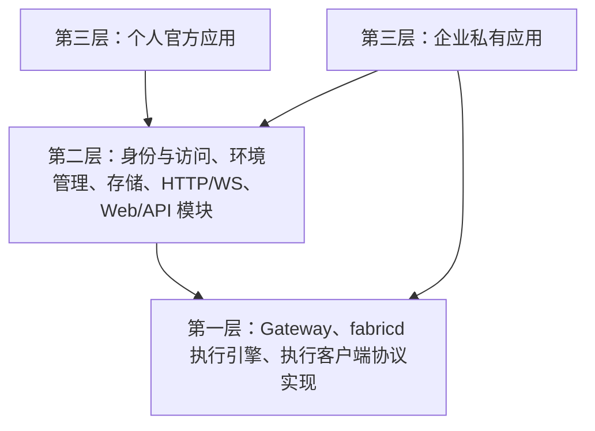

# Dune 开源扩展与企业私有部署方案

日期：2026-09-06。状态：设计提案，尚未实现。本文定义产品与扩展边界，不表示当前已支持宿主 SDK、SSO、SQL 元数据、Managed 环境或 Gateway 集群。接口、配置和阶段名称均为拟议契约。

当前实现以代码和测试为准，PTY 生命周期见 [tmux 后端](tmux-backend.md)。本文不改变已有 HTTP/WS 部署能力，不恢复旧 server 兼容层。接入契约以通用身份源、已有开发环境和托管执行环境描述。

## 1. 目标与范围

Dune 采用三层架构：第一层是协议与执行核心，第二层是可组合模块，第三层是应用组装。第三层提供个人官方应用和企业私有应用两种入口：个人一键部署启动；企业通过 Go 宿主 SDK 复用或替换模块，接入自己的身份、授权、执行环境、HTTP 框架和数据库连接鉴权。两种入口共享底层协议与执行能力，可复用工作台和环境管理模块。

| 决定 | 方案 |
| --- | --- |
| 第一层 core | Gateway、fabricd 执行引擎、执行客户端协议实现；不依赖用户、业务授权、Runner、资源管理、SQL 或 HTTP 框架 |
| 第二层模块 | 身份与访问、Runner、Attached/Managed、续期、SQL 存储、HTTP/WS 接入和可复用 Web/API |
| 第三层应用 | 官方入口和企业私有入口显式组装模块；企业也可仅基于 core 自建产品 |
| 官方入口 | 默认本地账号、owner 检查、SQLite 和 Attached，无需企业服务或外部数据库服务 |
| 企业入口 | 私有 Go 程序注入适配实现，可直接调用企业 SDK；不要求另部署适配服务 |
| SDK 边界 | 执行客户端 SDK 连接 Gateway；宿主 SDK 组装和运行 Dune，两者用途不同 |
| HTTP/WS 边界 | core 接收连接抽象；接入模块提供默认 HTTP/WS 实现，应用选择路由、框架和监听方式 |
| 路径与地址 | 固定相对路径，支持部署前缀；由 public_url 派生对外地址，gateway_url 可覆盖，fabricd 接收完整连接地址 |
| 单实例 | 支持 SQLite 或 PostgreSQL，Attached 和 Managed 均可使用 |
| 多实例 | 仅支持 PostgreSQL；同构 Web/Gateway 副本、共享连接目录、定向流式转发 |
| 身份与访问 | 企业提供已验证身份和统一访问检查；第二层执行业务准入，不建设企业成员、角色或共享管理 UI |
| 数据库接入 | 使用 Dune 的 SQLite/PostgreSQL 实现，仅定制连接与鉴权；需要共同事务的存储由同一后端创建 |
| 配置来源 | 个人入口读取配置文件；企业入口通过 Go SDK 注入；Web 不编辑部署配置 |
| Attached | 用户手动接入已有开发环境，无 Dune 管理的有效期；解绑不删除主机或工作内容 |
| Managed 首版 | 创建、查询、引导连接、使用、自动续期、销毁，以及失败处理和持久操作恢复 |
| 续期策略 | 企业适配器决定；个人入口从配置文件读取；浏览器关闭不主动删除资源 |
| 个人首次连接 | 确认获得资源引用后默认宽限 5 分钟，可配置；明确引导失败或超期后默认停止自动续期，不主动删除 |
| 销毁等待 | 关闭旧流默认最多等待 1 分钟，可配置；超时后可销毁已确认归属的资源，不要求证明旧输入全部停止 |
| 环境可用 | 当前绑定的 fabricd 完成认证连接且访问状态允许；不要求默认 Agent 或额外执行探测 |
| 数据责任 | Dune 保存身份关联、Runner、绑定、操作等元数据；工作内容留在执行环境 |

首版产品不提供面向 CI、机器人或其他无人值守调用者的身份与调用入口。人类用户已提交操作的后台跟进及 Managed 自动续期属于第二层生命周期模块的职责，不要求浏览器一直在线；第一层不感知这类产品身份与策略。

首版不建设通用 HTTP/gRPC 扩展协议、动态插件、通用策略引擎、完整 IAM、企业组织目录同步、云资源调度器或新的 ACP 宿主。资源级停止/启动、快照、恢复和克隆只保留为后续方向，暂不定义稳定接口，不纳入首版验收；现有 `runtime.stop` 等会话操作保持原语义。多区域容灾、root 身份切换和强制命令沙箱也不属于本期。

核心、官方入口、宿主 SDK、默认实现和集群能力应可从公开源码独立构建。企业 SDK 与私有封装留在独立工程。许可证、商业授权和收费方式另行决定，不以隐藏依赖限制基础使用。

## 2. 当前基础与待实现部分

| 当前实现 | 本方案需要补齐的能力 |
| --- | --- |
| `internal/webapp` 处理账号、owner 检查和浏览器适配 | 提取可复用 Web/API、身份与访问模块及宿主组装入口 |
| `internal/webapp/store.go` 原子 JSON 保存账号、会话与机器 | SQLite/PostgreSQL、迁移工具及跨对象业务事务；JSON 退出新版本运行时后端 |
| `internal/gateway` 混合 HTTP/WS Upgrade、认证回调、绑定检查和转发 | core 保留协议与转发；连接认证和 HTTP/WS 接入移入模块，业务请求统一交给上层处理 |
| `internal/wire` 已将 WS 包装为 `net.Conn`，拨号与协议代码仍混合 | 分离连接拨号/适配与协议实现，默认传输保持 WS + Yamux + 长度前缀 protobuf |
| Web 服务内部生成内存 SDK ticket，客户端 SDK 接收 Token | 增加人类 CLI 登录和短期凭据交换，不能把内部 ticket 当作已有公共登录能力 |
| fabricd 反向连接 Gateway，tmux 独立持有 PTY | 保持执行链路；补齐连接租约及跨实例归属变更 |
| 安装脚本与一次性 enrollment | 复用 Attached 接入；Managed 增加提供方引导及预期资源绑定 |
| Machine 是连接目标，Runtime 是远端会话 | 增加稳定 Runner、Fabric 绑定、持久 Operation 和续期记录 |

[Runner/Fabric 模型](stories/upper-layer-products.md) 提供逻辑身份与运行后端的边界。本方案在产品层实现 Runner 管理，底层 Gateway、fabricd 和执行客户端 SDK 仍可独立使用；不把组织管理或云资源调度并入执行协议。

## 3. 三层架构与两种应用入口

### 3.1 依赖方向



箭头表示代码依赖。第一层不能反向依赖第二层或第三层，模块之间使用显式依赖，不通过全局注册表形成隐式调用链。分层不等于拆成三个进程、多个仓库或独立发布的插件；Gateway 与 fabricd 仍分别运行在服务端和执行环境中。

本文将“core/协议核心”限定为第一层，身份、Runner、存储和续期等产品职责明确归入第二层，不再用“核心”泛指所有 Dune 功能。

### 3.2 第一层：协议与执行核心

第一层负责消息编解码、Dune 握手、Yamux 多路复用、路由与定向转发机制、背压和协议限制，校验目标、连接角色、incarnation/generation 及连接归属。fabricd 的 PTY、ACP、文件、Git、端口和会话生命周期属于执行基础，不能为了只留下连接协议而移除。

core 不认识用户、OIDC、企业角色、Runner、Attached/Managed、资源有效期或 SQL schema。它提供解析请求、交给上层处理、转发、关闭连接/流，以及执行过期连接约束等机制，不决定用户是否有权执行操作。业务 `AccessChecker` 不属于第一层。

core 统一持有底层连接与流的读取、转发和关闭循环，第二层通过处理钩子接收已解析消息和受控操作句柄，决定拒绝、处理或放行。模块不直接读取同一条底层流，也不自行启动并行 copy 循环。连接与处理器必须显式装配，不能因未注册处理器而静默绕过业务检查。

连接认证成功后，第二层为该连接创建处理器，将已验证身份及会话关联保存在处理器中。该关联不能由协议请求体覆盖，不使用全局“当前用户”；需要刷新的是会话/权限有效性，而不是随消息替换连接身份。core 只持有处理器接口，身份与 Runner 上下文仍留在第二层。

| 处理阶段 | 所有权与行为 |
| --- | --- |
| 首条请求 | core 解析并做协议校验，再调用处理器；模块完成目标解析及访问检查后通过句柄选择处理或转发 |
| 后续消息 | core 在交付或转发前调用相应钩子；同一流保持顺序，不同流可在既有并发上限内独立处理 |
| 写入与背压 | 模块通过受控句柄发送结果或请求转发，core 统一串行写入并执行有界缓冲；钩子阻塞受超时与取消限制 |
| 失效与退出 | 模块通过句柄取消该流，core 解除阻塞读取并结束转发；关闭幂等，退出通知只触发一次 |

持续输入的钩子可以使用模块维护的有效访问决定，不逐字符调用企业权限系统。访问模块独立调度授权到期，空闲流也能被取消，不依赖下一条输入到达才发现撤销。

### 3.3 连接抽象与 HTTP/WS 接入

第一层接收已建立的可靠、有序双向字节连接，不定义 HTTP 路由、Cookie/Header 规则、WebSocket Upgrade 或 HTTP 服务生命周期。优先使用 `net.Conn` 等已有抽象，避免为了更换框架再造通用 Transport 系统。

```go
// 示意入口；实际类型在实现时收敛。
func (g *Gateway) ServeConn(
    ctx context.Context,
    conn net.Conn,
    binding BindingContext,
    handler ConnectionHandler,
) error
```

BindingContext 只描述上层确认的连接角色、目标及必要协议上下文，不包含用户、OIDC 或 Runner。ConnectionHandler 表示该连接的第二层处理器，具体签名以以上阶段契约收敛。连接来源的认证由接入模块完成；core 校验握手与可信上下文一致。连接交给 ServeConn 后由 core 负责关闭，模块使用受控句柄而非裸连接；接口须明确并发读写、deadline、取消及关闭后的行为。

第二层提供默认 HTTP/WS 接入模块：将 HTTP 请求经连接认证后升级为 WS，包装成 `net.Conn` 交给 core。第三层选择 HTTP 框架、监听地址和路由挂载；企业可复用默认实现，或用自己的框架完成 Upgrade 后复用连接适配。core 的公开接口不暴露 `http.Request`、`ResponseWriter`、框架 Context 或具体 WebSocket 库类型，也不自行监听 HTTP 端口。

```text
应用选择的 HTTP 框架 / 路由
    → 接入模块：连接认证、WebSocket Upgrade、连接适配
    → core：握手、协议校验、解析业务请求
    → 第二层请求处理器：身份、目标解析、访问检查
    → core：执行底层转发及流控制
```

Upgrade 前的连接认证不代替连接内各个业务请求及持续访问的授权。模块层装配时必须覆盖所有输入路径，不能暴露绕过处理器的第二个转发入口。

HTTP/WS 接入模块负责保留统一的 Cookie/Origin 校验、请求大小限制、错误响应及 WS 生命周期规则，不能因为替换框架而省略检查。长期连接上下文由应用生命周期管理，不机械沿用 handler 返回即取消的框架请求上下文。对外路径和代理挂载按第 9 节的地址契约处理。

fabricd 执行引擎和执行客户端协议实现使用对应的连接建立抽象；发布的 fabricd 二进制及客户端便捷拨号入口装配默认 WS Dialer，用户无需实现传输。执行客户端的浏览器登录与凭据获取由第二层模块提供，底层协议实现不依赖用户会话库。

分层重构本身保持现有 WS + Yamux + 长度前缀 protobuf，不因替换框架而改变消息格式或要求重新实现客户端。后续集群所需的 peer、租约等协议扩展按第 8、11 节协商和升级。上层可以替换 HTTP 框架与路由，不能随意改变 Dune 协议并宣称与官方客户端兼容。不为验证抽象额外实现 TCP、QUIC 等传输，也不把默认接入模块变成可动态加载的插件。

### 3.4 第二层：可组合能力与接口归属

第二层同时包含业务能力、可替换接口与默认实现。接口定义在实际使用它的层或模块中，不把所有 interface 集中放入 core。

| 接口或能力 | 定义与实现归属 |
| --- | --- |
| 连接、协议请求处理、流控制、连接目录语义 | 第一层使用和定义；默认内存路由不依赖产品数据库，PostgreSQL 目录实现在第二层 |
| IdentityProvider、用户会话与登录事务存储 | 身份模块定义；身份提供方可替换，持久化使用 Dune 所选数据库后端 |
| AccessChecker | 访问模块定义并调用；个人 owner 检查和企业检查是不同实现 |
| Runner、Operation、FabricProvider、RenewalPolicy | 环境管理模块定义；Attached、Managed 和续期复用其业务事务与调度 |
| SQLite/PostgreSQL、数据库连接工厂 | 存储模块提供；消费者接口在内部按领域定义，同一后端创建并共享事务，应用仅定制连接与鉴权 |
| HTTP/WS 接入、可复用 Web/API | 第二层提供默认实现；产品逻辑与具体 HTTP 框架绑定代码分开 |

UserStore、RunnerStore 等即使只是接口，也不属于不认识这些业务对象的 core。模块化不取消跨对象事务：Runner、绑定、Operation 和身份注册仍按第 5 节的原子操作提交，不能由几个模块依次各自 Save 代替。

首版不把各领域 Store 独立替换作为公共扩展承诺。应用选择一个 Dune 存储后端，后端统一创建领域存储与业务事务执行器；不允许通过宿主 SDK 拼接来自不同事务域的用户、Runner 和 Operation 存储。

Web/API 是可复用模块，不只存在于个人应用中。企业保留默认工作台时可以直接复用；替换框架时只适配接入和 handler，不必复制账号、Runner 或生命周期逻辑。模块组合使用普通 Go 包、显式构造函数和少量消费者接口，不引入自动扫描、统一插件总线或动态依赖注入容器，也不承诺任意模块组合均有效。

Web 模块提供固定且有限的启动信息：可用登录方式及公开入口、是否允许本地注册、是否启用 Attached/Managed、必要的公开地址。工作台据此显示登录和功能入口；未装配功能不显示为可用。提供方状态及可见模板通过经过访问检查的业务 API 查询，暂不可用时保留原因提示。启动信息不包含 Secret、内部模块依赖图或动态 UI 插件描述；隐藏按钮不能替代服务端访问检查。

### 3.5 第三层：应用组装与宿主 SDK

官方应用和企业私有应用是同级入口。官方应用通过宿主 SDK 选择本地身份、owner 检查、SQLite、Attached、默认 HTTP/WS 与工作台，负责配置读取和进程启停。个人启用 Managed 时选择发行版实际提供的适配实现，不能把未编入二进制的提供方当作已支持能力。

企业应用可以复用这些模块，也可以替换身份、访问检查、提供方 SDK、续期策略、数据库连接鉴权及 HTTP 框架；需要自建产品时可以只使用 core。企业私有依赖不进入公开模块。

宿主 SDK 是公开的组装入口，不是包含全部业务的另一个大核心。它提供可启动和关闭的应用对象，以及挂载到已有 HTTP 服务所需的模块入口，支持外部 context；自带服务和外部服务两种模式须明确 listener、连接池和 worker 的所有权及关闭顺序。默认启动入口也使用这套接口，避免企业只能依赖内部包。

数据库工厂支持池中新连接的鉴权及凭据更新，不能只在启动时获取一次短期密码。公开类型不得依赖 `internal` 包、企业 SDK 或应用配置结构。第一版以官方应用和一个独立封装示例验证公开边界，不提前拆多仓库或暴露全部内部 Store/worker 为稳定 API。

### 3.6 单实例与多实例组合

完整产品的单实例组合支持 SQLite 或 PostgreSQL、内存连接路由和同一套持久生命周期。SQLite 使用本地持久文件并限制一个 Dune 实例持有，不能通过共享盘用于集群。只使用第一层及默认传输的最小程序不需要用户库、Runner 或 SQL 数据库。

多实例组合运行同构应用副本，共享 PostgreSQL 元数据和连接目录实现。用户入口可负载均衡；fabricd 连接的 owner 由连接目录确定，内部转发定向到具体实例，最多一跳。第一层只依赖目录的事务/租约语义，不依赖 PostgreSQL 驱动；完整组合不要求另装 Redis、etcd 或独立服务发现系统。

## 4. 身份、访问检查与人类客户端

本节属于第二层身份、访问及客户端登录模块。第一层只取得可信连接上下文和已装配的请求处理器，不直接调用身份提供方或读取用户数据库。

### 4.1 身份边界

内部 principal 以稳定 ID 关联外部身份。OIDC 使用 `(issuer, subject)`，其他身份实现必须提供等价的稳定命名空间与主体标识；邮箱、姓名只作显示属性，不据此自动合并账号。已有账号的关联需要显式、可审计的流程。

采用 OIDC 的实现负责 Authorization Code + PKCE，以及 state、nonce、签名、issuer、audience、有效期和正常密钥轮换的验证。使用成熟协议库，不接受未验证身份头。通过身份代理时，必须验证代理身份并阻断客户端伪造或绕过入口的路径。身份接入参数由启动入口提供，无企业登录配置 UI。

登录事务、一次性回调状态及 Dune 会话由 Dune 写入所选数据库，支持登录发起与回调落到不同实例。浏览器使用 Dune 不透明 session cookie。默认不保存上游 access/refresh token，也不把登录凭据当作开发环境凭据；企业所需凭据交换在私有集成侧处理。

| 身份 | 有效用途 |
| --- | --- |
| 用户 principal | 人类浏览器、CLI、执行客户端 SDK 的访问检查 |
| MachineIdentity | 指定 machine 的 fabricd 连接，不能调用用户或资源管理入口 |
| PeerIdentity | Gateway 内部转发，不能自行构造终端用户授权 |
| 提供方调用凭据 | 由适配器管理，权限和资源平台归属由企业处理 |

平台调用身份和终端用户身份不要求相同。环境管理模块保存实际请求发起者和资源关联，但不决定企业云账号、额度或计费规则。提供方 SDK 检查不能代替 Gateway 请求处理链中的访问模块，因为后续终端、文件和 ACP 流量不经过提供方 SDK。

默认一个部署对应一个信任域，不提供多企业租户管理。企业成员、角色、共享关系和组织目录由企业负责，Dune 不持久化一套平行的企业授权模型，也不提供共享管理 UI。

### 4.2 统一访问检查

```go
// 第二层访问模块的示意接口，不属于协议 core。
type AccessChecker interface {
    Check(context.Context, AccessRequest) (AccessDecision, error)
}
```

AccessRequest 包含已验证 principal、服务端解析的 Runner/machine/Runtime 及绑定身份、实际 operation 和子操作、请求 ID、必要且受控的资源属性。AccessDecision 至少包含允许/拒绝、稳定原因码、决定 ID 和有效期限。不向检查器默认传递完整命令、终端内容、Agent prompt、环境变量或原始浏览器请求体。

身份和访问检查可以由同一个企业适配实现提供。OIDC 声明可以作为其输入，但登录成功不等于对所有目标自动放行。企业实现决定共享规则；默认个人入口使用 owner 检查。两者选择其一，不采用“任意一个允许即允许”的组合。

访问模块复用实际操作语义，维护入口及子操作到检查请求的完整映射，不额外建设几十个可配置企业角色或 IAM action。必须覆盖 Web、CLI、执行 SDK、文件上传提交、Git 写入、端口以及持续流中的输入、resize、signal 和托管 ACP 操作。只读 attach 不得通过其他输入类型获得写能力；原始 ACP 整体检查或禁用，不宣称能逐条授权其中所有 JSON-RPC 方法。

Runner、机器、模板和 Operation 的发现与查看同样需要检查。个人入口按 owner 筛选；企业入口对有界候选逐项或有限并发检查，继续扫描直到填满页或达到扫描上限，返回可继续的游标，不暴露未授权条目或总数。首版不另建企业成员查询或共享管理接口。

访问模块检查凭据有效性、机器撤销和当前 Runner 绑定；core 继续检查目标、Runtime 执行身份、单输入 owner 及协议/大小限制。企业 allow 不得绕过这些条件。未知操作及不支持的约束拒绝。管理员的站点配置能力不隐式赋予读取所有终端内容的能力。

### 4.3 长连接与撤销

建议初始上限：访问检查超时 1 秒，允许决定及访问租约最多 30 秒；可按部署调整并实测撤销延迟。新请求检查失败或超时即拒绝，不回退个人 owner 检查。访问模块管理授权有效期与提前复核，期限结束仍无法复核时调用 core 的连接/流关闭机制；终端字符无需逐个查询企业系统。core 执行关闭和阻止后续传输，不需要理解用户停用、企业权限或撤销原因。

机器撤销、Dune 用户停用及会话失效更新数据库中的权威状态和授权版本。通知只用于加速，各实例仍定期复核；企业适配器必须说明其身份停用和策略变更的新鲜度。不能用登录时永不过期的 group 快照承诺快速撤销。若外部身份源不能提供停用通知或查询，只能承诺相应会话有效期内的停用边界。

关闭访问不回滚已受理命令，也不自动停止远端 Agent。审批历史回放不生成新的可批准请求。企业隔离需求应由不同 OS 用户或独立 sandbox 实现；目录选择和入口检查不能限制获准运行的 Shell 内部所有系统调用。

### 4.4 CLI 与执行客户端 SDK

首版提供一条人类登录路径：CLI 创建带本地证明材料的短期登录事务，打开 Dune 浏览器登录页；用户完成登录并确认该 CLI 请求后，CLI 以证明材料消费一次性结果，取得绑定用户会话的访问凭据。事务和消费状态存于数据库，限定站点、客户端挑战、有效期和单次消费，防止其他客户端领取或重放；不要求外部身份源支持另一套设备登录协议。

CLI 本地凭据按私有文件保存，退出登录或用户停用可撤销。客户端登录模块使用该用户会话换取短期访问上下文，再交给默认拨号/接入实现；执行 SDK 的底层协议实现不处理用户会话。每次访问仍由访问模块校验目标、实际请求及当前绑定，不能把一次登录变成无限目标权限。会话到期需要人类重新登录，不提供永久用户 API key 或服务主体入口。

集群使用可跨实例验证的访问凭据，替换当前内存 ticket/闭包的跨进程假设。原始机器凭据和 peer 凭据始终不能作为 CLI 用户凭据。独立底层 SDK 部署的原有行为不等于已具备上述企业登录能力。

## 5. 数据库、事务与配置责任

### 5.1 两种数据库，同一套业务语义

Dune 的第二层存储模块实现 SQLite 和 PostgreSQL 后端，企业使用这些实现，仅定制连接建立及鉴权。领域接口用于组织内部依赖，不作为首版可独立替换的公共扩展点。第一层不导入 SQL 驱动，也不定义用户或 Runner 存储接口。连接必须提供所选后端所需的事务和条件更新语义；任意 SQL/KV 服务不能仅凭能建立连接就被当作受支持数据库。

身份与环境管理模块通过存储接口保存 principals、外部身份关联、会话、登录事务、enrollment、机器身份、Runner、Fabric 绑定、Operation 和续期调度状态。集群的 PostgreSQL 目录模块额外保存实例及连接归属。提供方与模板由启动配置定义；数据库只保存运行对象需要的非敏感配置标识、版本和受控快照，不成为第二个配置编辑入口。

不保存 Agent 对话、PTY 历史、代码、完整命令、Profile 环境变量或原始提供方响应。机器凭据只存验证所需哈希；Secret 用引用表示，不把云凭据写入业务记录。

### 5.2 原子业务操作

领域模块提出原子业务操作，同一个后端工厂创建其存储实现及事务执行器，保证操作内所有读写使用同一事务。连接到同一数据库但各自提交不满足该条件，不能把事务拼接责任交给应用启动程序。以下步骤必须由一个业务事务提交，不能让 handler 依次调用多个独立提交的 Store 方法：

| 原子操作 | 一起提交的内容 |
| --- | --- |
| 完成身份关联 | 外部唯一身份与内部 principal，冲突时整体失败 |
| 完成机器注册 | 消费 enrollment、创建机器凭据哈希、校验预期资源并提交 Runner 绑定 |
| 开始生命周期变更 | 幂等键和请求摘要、Operation、Runner 业务互斥、必要的访问限制及修订 |
| 提交操作阶段 | 比较执行权与预期绑定，提交阶段结果、已知资源引用和后续待办 |
| 提交绑定切换 | 当前绑定指针、旧凭据失效、新绑定状态和关联操作进度 |
| 安排续期 | 当前策略版本、下一执行时间、到期事实和去重状态 |

外部 SDK 调用始终在数据库事务之外。先持久化意图，再调用外部系统；数据库提交成功不代表外部动作成功。两种后端使用同一组业务契约验证原子性与并发冲突，而不是仅比较最终表字段。

### 5.3 配置与存量资源

身份、数据库、提供方、模板和续期策略统一从启动入口取得。模板公开字段有类型、范围和大小限制；用户只能填写这些字段，不能覆盖私有提供方配置或 Secret。首版通过协调重启应用配置变更，不建设通用热更新控制面。

Fabric ID 对应稳定的提供方命名空间。凭据轮换可以更新连接材料，但切换云账号或资源命名空间必须使用新的集成标识，不能让旧 resource_ref 被发送到另一个后端。存在 Runner、残留资源或未完成 Operation 时，集成可以禁止新建，但不能静默移除查询和清理所需的配置。

创建操作固定模板版本及参数摘要；续期采用当前有效策略，持久记录每次决策版本。多实例启动校验关键配置的非敏感版本指纹，拒绝同时运行互相冲突的配置。凭据轮换不要求把敏感值纳入数据库或日志。

### 5.4 保留与清理

实现前明确操作恢复窗口、幂等记录保留期及归档策略。适配器查询必须区分已知结果、仍在执行、从未接受的可靠证据、记录已过期和无法确认；简单“未找到”不能被解释为“可重新创建”。

已完成且无残留资源的 Operation 和 Runner 可按保留期归档。unknown、未完成清理、有效绑定或资源引用不能随普通历史删除。幂等摘要或拒绝过期重试的记录至少覆盖承诺的恢复窗口；窗口之外要求新的人类核对流程，不复用失去证明材料的旧键自动执行。

## 6. Runner、Attached 与 Managed

本节属于第二层环境管理模块。Runner 与提供方资源解析成具体连接目标后，再调用第一层执行能力；core 和 fabricd 不根据 Runner 状态自行申请、续期或删除资源。

### 6.1 稳定对象与连接身份

Runner 是产品入口，以稳定 `runner_id` 标识；Fabric 是配置的运行后端。首版一个 Runner 只有一个当前绑定，保存 `fabric_id`、提供方 `resource_ref`、`machine_id` 和单调 `binding_revision`。Runtime 继续表示当前执行环境里的 PTY/ACP 会话。产品层不另建 Environment ID。

Runner ID、Fabric 绑定修订、Gateway 路由 epoch 和 daemon incarnation/generation 分别表示逻辑对象、资源关联、连接归属及执行身份，不能相互替代。目标解析后固定具体绑定；旧请求不得因为 Runner ID 相同自动改投另一个资源。绑定变化撤销旧注册材料及机器身份，不能复制访问身份。

### 6.2 Attached

用户取得一次性安装/绑定命令，在已有开发环境中手动安装并连接 fabricd。Dune 不申请、停止或销毁该主机，也不设置环境到期时间。无限使用指没有 Dune 管理的 TTL，不意味着网络、进程或主机永不故障。

解除绑定关闭 Dune 访问并撤销机器凭据，不删除文件、不结束本地任务。现有安装脚本继续作为默认入口。Attached 无需实现资源创建、销毁和续期接口。

### 6.3 Managed 最小适配能力

适配器通过 Go 调用提供方 SDK，处理平台权限、配额、凭据和资源命名空间。Managed 模块通过 FabricProvider 依赖下列语义；方法签名在首个真实适配闭环后收敛：

| 能力 | 需要返回的事实 |
| --- | --- |
| Create | 是否接受、已知资源引用、同步结果或后续查询线索 |
| Inspect | 资源事实、最后观测时间、有效期及是否明确不存在 |
| Bootstrap | 为预期资源注入独立绑定材料并启动 fabricd 的结果 |
| Renew | 续期是否接受、最新确认到期时间或查询线索 |
| Destroy | 删除是否接受、已知副作用及确认删除的依据 |
| Reconcile | 按 Dune 操作关联核对结果；无可靠证据时返回 unknown |

这些能力不要求提供方原生具有相同名称或持久 Operation API。同步创建、异步任务或按关联元数据查询均可被包装，但适配器必须声明去重、查询新鲜度、记录保留和过期语义。只有关联搜索能力时，不能宣称已经拥有唯一性或 exactly-once 保证。

每个变更携带 Dune operation ID、动作/阶段内稳定的幂等键、请求摘要、预期绑定及执行修订。不同动作不得共用一个提供方幂等键；相同键而参数摘要不同则拒绝。结果包含受控状态、错误码和已知引用，不保存整个 SDK 响应。生命周期模块不因方法返回 nil、HTTP 成功或连接 EOF 就认定资源已达到业务终态。

适配器声明其实际引导方式、续期条件与必要的资源事实，不提前定义覆盖所有云平台的能力矩阵。首版每个接入的 Managed 提供方必须能完成创建、引导、查询、续期和销毁闭环；未实现的资源级停止、快照等能力不显示为可用。

### 6.4 引导与就绪

Managed 模块先保存 Runner 和创建 Operation，再申请资源。适配器可以通过预装镜像与启动配置，或提供方管理通道完成安装和启动；不要求每个提供方同时实现两种方式，也不要求容器具有 systemd。引导发生在 fabricd 可用之前，不能依赖尚未建立的 Dune Exec 链路。

安装来源和版本固定，绑定材料短期、单次消费，限定 Runner、当前 Operation、Fabric 及绑定修订。资源分配后，环境管理与注册模块先确认材料与预期 resource_ref 的关联，再允许消费。需要创建时注入启动信息的后端，可携带未激活引用，资源确认前不能建立有效绑定。

镜像不包含已注册机器配置或长期凭据。注册结果丢失时，查询已消费状态；必要时撤销不完整身份并换发，不能重放同一个 enrollment 当作通用机器凭据。原始机器凭据仅交付对应实例，不进入用户可见操作结果或日志。

提供方 running、安装成功、fabricd 在线和 Runner 可访问分别记录。只有当前绑定的 fabricd 完成认证及路由确认、且访问门未关闭，才显示“环境可用”。不设默认 Agent，也不以 Agent 启动或 Profile 初始化为条件。反向 WS 可达性、启动方式和实际镜像必须在目标提供方验收，不能从支持进程 API 推导为隧道已可用。

## 7. 持久操作、续期与失败处理

本节由第二层生命周期、续期、访问和存储模块协作实现。底层只提供具体连接的转发、失效与关闭机制，不运行资源管理 worker。

### 7.1 操作恢复与执行权

创建过程为 queued → creating → bootstrapping → waiting_connection → succeeded；失败、超时和 unknown 分开记录。浏览器关闭不取消 Operation。重启后 worker 先核对当前阶段与外部事实，再决定是否能继续，不重跑整个流水线。

worker 用租约和条件更新领取工作，并携带单调执行修订。更新结果时比较领取身份、执行修订及绑定，旧 worker 不得覆盖新阶段。Runner 的业务互斥与 worker 的领取租约分开：worker 租约到期只允许接管跟进，不代表之前的外部动作已结束或可开始冲突动作。

数据库条件更新不能阻止旧 worker 向外部系统发出迟到调用。适配器在调用前检查执行上下文，并如实声明提供方能否拒绝旧修订或按键去重。若无法在外部系统隔离旧执行者，在确认旧调用及其副作用结束前，接管者只能查询、不能发出冲突变更。进程退出、context 取消或 HTTP 超时均不足以证明外部调用已取消。

创建响应丢失时，优先按操作关联核对。只有可靠证据确认未提交，且能排除迟到请求或提供方保证同键去重，才继续该阶段。查询未找到、历史过期或事实不一致均保持 unknown，显示已知引用和人工核对入口。人工重试需要当前访问检查和核对依据，不能以点击按钮绕过去重边界。

### 7.2 自动续期

续期策略与续期执行分离。RenewalPolicy 接收 Runner、提供方事实、已确认到期时间、当前配置和必要的发起者关联，同时取得当前生命周期阶段、阶段起始时间、首次确认资源引用的时间、是否曾经可用及失败/unknown 原因。策略返回是否续期、目标期限或时长、下一次检查时间及原因。企业实现决定这些规则和平台权限；个人入口从配置文件构造默认策略。续期模块不自行推导“用户不活跃应删除”或“断线应重建”。

个人入口的默认策略如下，企业适配器可自行决定对应规则：

| 状态 | 个人默认续期行为 |
| --- | --- |
| 已正常可用 | 按配置自动续期；浏览器关闭不影响维护 |
| 已确认资源引用、尚未首次连接 | 在首次连接宽限期内允许续期，默认 5 分钟，可通过 `first_connection_grace` 配置 |
| 明确引导失败，或尚未首次连接且已超过宽限期 | 停止后续自动续期，保留记录并显示最后确认到期时间及原因，不主动删除 |
| 曾经可用后离线 | 不重新套用首次连接宽限期；先核对资源事实，不能把网络失联当成明确引导失败或资源消失 |
| 提供方确认已到期/删除，或已进入销毁 | 不再安排续期，不自动重新创建 |

宽限期从 Dune 首次确认获得资源引用时开始，时间随 Operation 持久保存，刷新页面、重启 worker 或重复查询不重置计时。宽限期限制的是个人默认自动续期，不修改提供方已有 TTL，也不代表 5 分钟后立即删除资源。尚未获得可靠资源引用的 unknown 不允许对猜测目标续期；先按操作关联核对。停止续期后若事实发生变化，仍由当前策略重新判断并记录原因。

自动续期不依赖浏览器在线或某个登录 session 的持续有效。它以创建时建立的资源维护范围和当前续期策略执行，记录原始创建者、维护触发来源及策略版本，不冒充一条当前用户请求。用户停用后是否继续维护由企业策略决定；该执行身份只用于跟进已受理操作和维护已有资源，不获得自动创建、任意执行命令或对外无人值守访问权限。

续期模块持久化下一次执行时间、最后确认到期时间、策略版本和结果，多实例只领取一份续期工作；续期与销毁使用同一 Runner 业务互斥。获得明确资源引用和有效期后即纳入策略判断，不等待环境就绪。创建或引导的外部变更已确认结束后，等待连接阶段允许续期，不因页面仍显示创建中而阻塞维护；尚未结束的冲突调用仍遵循上一节的执行限制。调度提前量须覆盖调用耗时、故障接管和退避，并加入抖动，避免集中请求。提供方将 TTL 定义为“从当前时刻起”时，适配器必须转换为明确的到期事实，不能盲目重放使期限无限后移。

续期超时先查询有效期，按提供方去重保证决定是否重试；未知结果不假报已续期。策略明确停止时取消后续计划，不主动删除资源。策略错误或暂不可达时记录异常并有界重试，不继续套用无限期旧策略；页面显示到期风险与最后确认时间。

资源由提供方确认到期或删除后，关闭旧绑定访问并失效机器身份。Dune 停机期间无法保证续期；启动后先核对事实，不把过期环境自动重新创建。工作内容能否持久保留由提供方存储保证决定，首版不承诺文件、进程或 Agent 会话的过期恢复。

### 7.3 关闭访问与有界销毁等待

Managed 销毁先持久化禁止新访问、暂停续期并撤销接入材料，再尝试关闭旧流。旧流关闭采用有界等待，默认 1 分钟，可通过 `destroy_access_close_timeout` 配置。等待超时后，可继续销毁已确认归属的资源，不以证明旧输入全部停止为删除前提。这个流程不复用现有 machine.revoke 的删除记录语义，也不与 `runtime.stop` 混用。

| 阶段/结果 | 生命周期与访问模块行为 |
| --- | --- |
| 接受销毁 | 原子保存 Operation、业务互斥、暂停续期、访问限制及其修订，撤销对应 enrollment 和机器身份 |
| 等待旧流关闭 | 通知 owner 关闭本地及跨实例旧流；收到匹配连接/访问修订的确认可提前结束等待，记录未确认连接 |
| owner 失联或等待超时 | 默认最多等待 1 分钟，不因重复领取而重置等待起点；资源归属已确认时继续删除，记录旧流关闭未确认 |
| 删除调用前 | 核验 fabric_id、resource_ref 和当前操作/绑定的关联，保留引用并提交执行阶段后调用适配器；归属不明则继续核对 |
| 明确删除成功 | 标记资源已销毁，保留必要操作及幂等记录，解除业务互斥 |
| 明确失败或 unknown | 保留访问限制、已知资源及待清理项，暂停续期，不自动解封或重新创建 |

访问限制覆盖本地、跨实例、直接 machine target 和既有 attach/上传等流。模块拒绝新的访问决定，并使已有决定和连接按其失效机制退出。等待超时不表示旧输入已经停止，更不表示资源已删除；平台确认销毁之前，已受理命令可能继续执行。界面分别展示关闭流的结果和资源删除的结果，不宣称任务回滚。

集群防止过期连接写入的规则仍然保留：fabricd 在实际接受输入时检查协议连接身份和有界输入租约，不因销毁允许超时继续而放宽 epoch/租约约束。是否销毁、何时结束等待由第二层决定，core 不查询 Runner 数据库或理解销毁原因。销毁等待超时只解除“等待旧流关闭”这一个前置条件，不解除第 7.1 节要求的外部操作互斥、旧 worker 隔离或结果未知约束。

首版失败处理选择继续核对或重试清理，不提供销毁后自动恢复接入。被撤销凭据不会因删除失败而重新生效。删除调用自身超时或响应丢失时保持 unknown，不能把关闭流的 1 分钟等待上限当作自动重发 Destroy 的理由；继续查询并按提供方的事实及去重保证决定后续步骤。删除请求已发出后取消等待不恢复访问或续期。

创建、引导失败默认不主动删除已知资源，除非用户显式发起销毁。是否维持续期仍由当前续期策略决定；默认保留不保证资源免于提供方 TTL、驱逐或外部删除。查询超时记录最后观测和未知事实，不标记为明确丢失。网络重连始终只重建连接，不触发新资源创建。

### 7.4 人工核对与受控继续

unknown 和残留资源需要可回到 Dune 的处理路径。首版只提供以下受控动作，每次均经过当前访问检查，并记录操作者、候选引用、核对事实和状态变更：

| 动作 | 必要条件与结果 |
| --- | --- |
| 重新查询事实 | 适配器按原 Operation 和已知资源关联查询；已被人工删除的资源，在提供方明确确认后可按原动作语义结束对应清理 |
| 提交候选资源引用 | 用户只提供候选 resource_ref；适配器核验提供方命名空间及资源与原 Operation 的关联，不能只比较名称或相信用户声明 |
| 继续阶段或清理 | 核对证据表明该阶段可安全继续，且执行修订、绑定和业务互斥仍匹配；复用原阶段关联，不重跑整个创建流程 |

候选资源核验通过后，关联与 Operation 进度由同一业务事务提交，拒绝覆盖另一有效绑定或重复认领；核验失败或证据不足则继续保持 unknown。资源归属由适配器事实确认，平台权限仍由企业 SDK 处理。发现原创建资源已经消失只能记录相应失败或清理结果，不能把它标记为创建成功。

不提供无条件“标记成功”、直接编辑绑定或强制清除业务互斥的入口。人工操作也必须遵守第 7.1 节的迟到调用与幂等边界；历史过期或一次搜索未找到都不足以证明可以再次创建。

## 8. Gateway 集群与连接目录

集群分层保持相同边界：core 使用连接目录接口并执行 epoch/租约和转发规则；第二层提供 PostgreSQL 目录实现、peer 接入、用户访问上下文及业务检查；应用选择数据库连接、实例地址和 HTTP/WS 接入方式。

### 8.1 连接归属

```text
Acquire(machineID, ownerBootID, expectedEpoch) → lease
Resolve(machineID) → ownerAddress + ownerBootID + epoch + binding + expiry
Renew(lease) → newExpiry
Release(lease) → released / stale
```

PostgreSQL 用事务、条件更新和数据库时间维护每个 machine 的单调 epoch。ownerBootID 包含本次启动身份，避免实例名复用；Release 同时比较 owner 和 epoch，旧进程不能删除新归属。首版在目录中保存可定向的实例地址，不引入独立 ServiceResolver 契约。普通随机负载均衡地址不能作为 owner 地址。

建议初始连接租约 15 秒、5 秒续约、路由缓存最多 2 秒，须实测调整。接入模块认证新 fabricd 并提供可信连接上下文，core 完成握手校验后申请归属；已有有效 owner 时拒绝并退避，不立即抢占。Gateway 与 fabricd 确认绑定和 epoch 就绪后再发布路由。

owner 使用保守的单调本地期限停止新 stream、关闭旧流及隧道；fabricd 的输入有效期不能因传输延迟而延长，过期后拒绝新输入。协议必须覆盖进程暂停、缓冲输入、网络分区和时钟扰动。这些连接归属约束独立于第 7.3 节的销毁等待上限，不能为了继续删除资源而延长旧连接权限。数据库恢复备份后更换集群恢复代次、使旧服务身份/epoch 空间失效并要求机器重连，不能让历史路由恢复访问能力。

### 8.2 定向转发

1. fabricd 经 B 的接入模块认证，B 的 core 完成连接握手并取得归属。
2. 用户请求到达 A，A 的访问及环境模块验证用户、解析目标并调用访问检查。
3. 检查通过后，A 的 core 查目录，本地命中直接转发；否则定向连接 B，最多一跳。
4. B 的 peer 接入及访问模块校验用户访问上下文、操作范围、撤销状态和产品绑定，core 校验协议绑定及自身归属，再转发给 fabricd。

peer 可复用已有长度前缀 protobuf/Yamux，但必须有明确角色和受控入口。访问上下文绑定用户会话、目标、operation/子操作、Runtime 身份、请求 ID、入口/目标实例、期限、授权版本、Fabric 绑定修订及访问修订，由第二层模块构造和验证；core 不解析用户与 Runner 的业务含义。可使用成熟签名机制并支持密钥轮换；签名不提供传输保密，peer 身份本身不授予任意用户权限。

owner 变化返回 ROUTE_STALE，不继续多跳代理。业务请求尚未提交时可刷新路由；一旦可能已发送，断链返回结果未知，不能自动重放启动、输入、Git 写入或 ACP prompt。浏览器重连只恢复订阅，不重放写入或把旧请求转投新绑定。

### 8.3 故障范围

入口故障中断浏览器连接，owner 故障中断机器隧道，恢复依靠重连，不迁移 TCP socket。tmux 仍由执行环境持有；fabricd 未退出时 ACP 可以继续，fabricd 重启会结束当前 ACP 进程。资源到期或外部重建不具备网络重连的进程保留保证。

readiness 区分新连接接入与已有连接健康。优雅退出先停止接新流和领取工作，有界排空后释放连接归属；未结束外部操作保留可接管状态。完整 HA 还依赖 PostgreSQL、入口及企业依赖自身的可用性。

## 9. 配置、部署与运维

### 9.1 对外地址与路径挂载

首版保持固定的相对路径约定，允许通过部署前缀整体挂载。`public_url` 是浏览器访问的绝对 HTTP(S) 地址，可带路径前缀；应用将路径规范化为以 `/` 结尾，拒绝用户信息、查询参数和 fragment。前端入口、静态资源、`api/...`、登录回调、下载及安装引导地址都从该地址派生，不能用根路径拼接丢掉前缀。复用工作台时，静态资源与能力配置入口也必须支持同一前缀。

例如 `public_url: https://example.com/tools/dune/` 对应 API 前缀 `/tools/dune/api/`，默认机器隧道地址为 `wss://example.com/tools/dune/tunnel`；HTTP 对应 WS，HTTPS 对应 WSS。相对路由由接入模块统一提供，宿主负责将它们挂载到对应入口。首版不提供逐个重命名 API 路径的配置。

`gateway_url` 可选，用于 fabricd 经独立网络入口连接 Gateway；未配置时从 `public_url` 派生，显式配置时必须是包含完整路径的绝对 WS(S) 地址。安装、enrollment 和 Bootstrap 都传递最终完整地址，fabricd 不猜测前缀。该覆盖只改变机器隧道入口，不改变浏览器 API、静态资源或登录回调，也不能代替集群的定向 owner 地址。

Cookie Path 使用规范化后的部署路径，Origin 检查使用 scheme、host、port，不把路径作为 Origin 的一部分。身份提供方登记的回调地址必须与带前缀的实际地址一致。宿主及反向代理显式约定是否剥离前缀，接入模块只执行一次路径映射；不根据客户端任意提供的 forwarded prefix 构造可信回调或机器连接地址。

### 9.2 配置与部署

以下只示意第三层个人入口的配置分组，不是当前可运行配置；企业入口通过宿主 SDK 提供等价参数和实现。配置文件解析、环境变量及 HTTP 服务监听属于应用装配，core 接收明确的运行参数和接口实例，不读取产品配置文件。

```yaml
mode: standalone # cluster 必须使用 PostgreSQL
public_url: https://example.com/tools/dune/
# gateway_url: wss://example.com/tools/dune/tunnel # 默认从 public_url 派生
metadata:
  driver: sqlite # 或 postgres
  path: ./data/dune.db
  # PostgreSQL 使用连接配置或宿主注入的连接工厂
identity:
  provider: local
authorization:
  provider: owner
  timeout: 1s
  max_validity: 30s
fabrics:
  - id: attached
    mode: attached
  # Managed 仅填写发行版实际提供的适配器及非敏感参数
managed_renewal:
  enabled: true
  extend_by: 1h
  renew_before: 10m
  first_connection_grace: 5m
  # 仅应用于配置的 Managed；实际范围必须符合提供方条件
managed_lifecycle:
  destroy_access_close_timeout: 1m
cluster:
  lease_ttl: 15s
  renew_interval: 5s
  # 集群还需具体 owner 广告地址与 peer 身份配置
```

启动拒绝 cluster + SQLite/JSON、SQLite 多实例、缺失必要适配实现、模板越界、非法对外地址、与已声明挂载前缀不一致的配置、不可定向的 peer 地址及不满足事务/租约语义的连接。领域存储由选定的同一 Dune 后端创建，宿主不能独立拼接不同实现；等待时长须为有效的非负有限值，显式设为零表示不等待。Secret 从私有文件或部署系统读取，不进入前端配置。某个提供方暂不可达时标记其事实未知或不可用于新建，不阻塞无依赖的 Attached 使用，也不遗失已有资源和操作。

一键部署负责默认配置、本地数据目录、默认 HTTP/WS 和安装包引导；默认 SQLite 不要求安装外部数据库服务。企业嵌入现有 HTTP 服务时自行挂载接入模块，宿主 SDK 不抢占端口或接管外部服务退出。保留 Linux/macOS fabricd 包、内部镜像/二进制源及离线包能力，安装时不强制从外网获取 tmux、前端 CDN 或 Agent。构建固定依赖并发布 notices。集群首个平台为 Linux。

观测记录连接数、owner 变化、续约失败、跨实例比例、延迟、背压、访问检查耗时、创建/引导耗时、操作 unknown、续期积压、到期风险与残留资源。Runner ID、operation ID、受控引用用于关联，不采集凭据或工作内容。

审计记录实际发起者、后台维护来源、操作、目标、决定/请求 ID、策略版本和结果。默认结构化事件可供企业采集；不把普通日志宣称为可靠审计。如果需要“审计持久化后才能执行”，另行定义 outbox 及失败语义，不作为本期默认依赖。

## 10. 分阶段交付

| 阶段 | 交付内容 | 完成条件 |
| --- | --- | --- |
| S0a 连接与传输拆分 | 分离 core 与 HTTP/WS 接入，定义连接处理器及流所有权，保持现有产品行为 | core 无业务/框架/SQL 依赖；默认 WS 客户端兼容；取消、背压和关闭符合契约 |
| S0b 模块与应用装配 | 提取身份/访问、Web/API 模块，公开组装入口、有限能力配置及部署前缀 | 官方入口使用同一 SDK；独立宿主复用工作台；按连接隔离身份；自定义前缀下各入口可用 |
| S0c SQL 存储与迁移 | 提供 SQLite/PostgreSQL 后端、连接鉴权注入、共享业务事务及 JSON 导入 | 两种数据库通过同一业务事务契约；跨对象失败完整回滚；现有数据导入后行为保持 |
| S1 身份与 Attached | 企业身份适配、浏览器及人类 CLI 登录、短期访问凭据、Runner/绑定迁移、配置注入 | 真实身份源完成登录与撤销边界验证；所有入口执行访问检查；已有机器无需重新安装 |
| S2 Managed 闭环 | 提供方 Go 接口、创建/查询/引导/销毁、持久操作、续期策略和调度 | 至少一个真实提供方完成使用闭环；响应丢失、重启、续期失败及清理失败结果准确 |
| S3 多实例 | PostgreSQL 目录、peer、定向转发、访问失效、有界销毁等待、worker 接管和排空 | 客户端与机器固定不同实例；网络分区及旧 worker 迟到调用验证通过 |

S0a → S0b → S0c 是依次验证的检查点；拆分期间沿用旧存储只是迁移过程，不形成新增的公开 JSON 后端。S1 在 S0c 后推进，S2 复用 S1 的 Runner 与绑定模型；S3 建立在 S0 的连接抽象、事务和模块边界上。单实例与多实例都属于本方案交付范围；S3 完成后还须验收 S1/S2 在集群下的登录、续期、绑定和操作接管。每阶段附带安装、迁移及验证材料，不再等待可选快照等功能后才整理企业交付。

私有集成应直接验证公开 SDK 是否足够，但企业代码和参考材料不进入公共仓库。首版不通过强制 HTTP v1 来冻结尚未验证的抽象。Go SDK 按发布版本维护兼容约定；接口变更配套示例和迁移说明，不保证任意版本混编。

## 11. 迁移与升级

旧 JSON 仅作为导入来源，新版本不保留第三套运行时存储。停止登录/注册写入并排空服务，备份私有目录，将账号 ID、密码哈希、机器 ID、凭据哈希和必要会话状态导入 SQLite 或 PostgreSQL，校验唯一性及关联后切换。导入现有机器为 Attached Runner，可沿用原 machine ID 作为初始 Runner ID；当前绑定和 Runtime 身份保持原语义，不要求重新安装或签发机器身份。

SQLite 转 PostgreSQL 同样采用停止写入、备份、导入、校验、切换，不引入双写或共享盘 SQLite。已有 Managed 时暂停 worker 和续期领取，迁移 Runner、绑定、Operation、幂等及调度记录；提前评估迁移时长与资源到期余量。外部已发出的任务可能继续执行，恢复服务后先查询事实，不能因导入或恢复备份重放 Create。

迁移失败在新后端开放写入前可退回备份；开放后必须停止写入并显式转换或恢复，不能直接切回旧库丢弃新增状态。路由不导入，由机器重连建立。备份后丢失的外部操作记录需要核对，无法确认时保留异常。

首次集群发布前明确 peer 协商、访问凭据及 SDK/核心兼容范围。schema 使用迁移锁；破坏性清理晚于旧实例退出。滚动升级只支持已验证组合，不兼容版本协调升级。升级中仍需说明 PTY 保留与 fabricd 重启导致 ACP 中断的实际范围，不恢复旧 server 协议。

## 12. 验收矩阵

| 场景 | 必须取得的证据 |
| --- | --- |
| 分层依赖 | core 不导入用户/Runner、SQL 驱动、HTTP 框架或具体 WS 库；最小 Gateway + fabricd 程序通过默认传输运行，无需用户库和产品数据库 |
| 传输与框架替换 | 默认 HTTP/WS 适配与另一种嵌入方式接入同一 core，无需修改 Dune 协议或官方客户端；连接关闭、deadline、取消和所有权符合契约 |
| 业务准入位置 | Upgrade 认证不替代请求检查；所有 stream 及持续输入经过模块处理链；缺失处理器不能静默直通；两个用户的连接处理器不串用身份；模块不竞争读流；空闲流也能撤销，终止通知恰好一次 |
| 公开构建与一键部署 | 无企业依赖可构建官方入口；SQLite 完成登录、Attached 接入、PTY/ACP 使用 |
| 私有宿主 | 独立 Go 示例仅依赖公开包即可替换身份、检查器、提供方、续期和数据库连接鉴权，挂载到已有 HTTP 服务并复用工作台，不复制个人应用的业务实现 |
| 工作台能力 | 有限配置反映登录方式、注册开关和启用的 Attached/Managed；关闭本地注册时不展示入口；禁用能力有明确提示，后端仍检查请求；响应不泄露凭据或模块内部结构 |
| 地址与前缀 | 根路径和自定义前缀下，静态资源、API、WS、登录回调及 Cookie 均可用；安装和 Bootstrap 使用完整机器地址；gateway_url 覆盖不改变浏览器入口 |
| 数据库 | 单实例 SQLite/PostgreSQL 均通过事务、并发冲突和重启恢复；领域存储与事务来自同一后端，跨对象错误完整回滚；SQLite 多实例启动被拒绝 |
| 数据库鉴权 | 动态凭据轮换后新建连接可用，旧凭据不出现在配置输出及日志；连接池按约定关闭 |
| 身份与 CLI | OIDC 验证、身份冲突、跨实例回调；CLI 挑战、结果单次消费、过期和撤销；机器凭据不能冒充用户 |
| 访问覆盖 | 企业决定控制 Web/CLI/SDK、列表、子操作和持续流；只读不可写，原始 ACP 不绕过；无共享管理 UI |
| Attached | 无资源 TTL；浏览器关闭和解绑不删除主机、文件或任务；迁移后 Runner ID 稳定 |
| Managed 接入 | 真实提供方创建、查询、引导、反向 WS、续期及销毁；无 Agent 仍可用，旧绑定不能误报就绪 |
| 注册与绑定 | 并发消费一次成功；响应丢失可核对/换发；跨对象提交失败不产生半绑定 |
| 操作与外部副作用 | 重启和接管后先查询；旧 worker 不能落库或绕过外部执行限制；未知创建不自动重放 |
| 续期策略 | 浏览器关闭不影响维护；个人首次连接宽限期默认 5 分钟且可配置，重启/查询不重置计时；明确引导失败或超期停止续期而不删除；曾可用后的离线不重新套用宽限期；企业策略、个人配置及策略错误有准确结果 |
| 续期故障 | 多实例无冲突领取，响应丢失先核对到期事实；停机跨过期限不自动重建；不会将未知状态显示为已续期 |
| 有界销毁等待 | 禁止新访问并通知关闭本地、peer、直接 machine 和已有流；默认 1 分钟且可配置，接管不重置计时；归属确认后可在等待超时后删除，归属不明不删除；删除响应丢失不盲目重发；失败保持引用及限制 |
| 人工核对 | 支持刷新事实、提交候选引用及受控继续；适配器核验原操作关联，拒绝重复绑定和强制标记成功；外部人工删除能收敛清理状态，证据不足仍为 unknown |
| 配置责任 | Web 不编辑部署配置；参数越界拒绝；集成命名空间变更不能改投旧资源；存量资源仍可查询清理 |
| 集群 | 至少三个 Gateway 验证一跳转发；两个用户与两条机器隧道验证隔离；真实 PTY/ACP、文件和 Git 可用 |
| 连接竞争 | 租约到期、旧 owner 清理、实例名复用、时钟扰动、进程暂停及缓冲输入不误用新旧归属 |
| 结果未知 | 断链不重放启动、输入、上传提交、Git 写入或 ACP prompt；查询过期不冒充从未提交 |
| 保留与审计 | 普通历史可清理，unknown/残留资源/有效幂等记录不丢失；数据库及日志不保存工作内容或凭据 |
| 升级与恢复 | JSON 导入、SQLite 转 PostgreSQL、备份恢复及指定版本升级可验证；资源有效期风险明确 |

实施前固定机器数、活跃流、操作量和可接受延迟，记录 p50/p95/p99、故障恢复时间、撤销延迟与续期调度延迟。数据库连接目录和 Managed 续期分别测量压力；没有业务目标时只报告实测规模，不宣称任意规模可用。

本文件的当前验收是设计内部一致性、引用、范围与现有实现的差异检查。实施阶段按 [开发流程](workflow.md) 和 dune-verify 技能选择对应回归及真实环境验收，不能以 mock、历史记录或跳过未实现能力代替当前交付证据。
