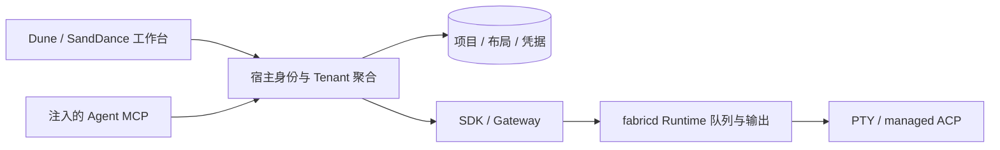

# herdr 工作台存储精简

2026-09-18 用户确认的新范围，取代原方案中的退出恢复和已读位置落库要求。原实施记录保留为历史验证证据，不代表这些能力仍属于当前范围。

## 目标

herdr 新增的持久化只保留三张表：`dune_projects`（项目及目录）、`dune_views`（个人布局）、`dune_agent_credentials`（MCP 调用方凭据）。SandDance 外部身份模式加上原来的五张 Dune 表，共八张；SandDance 自身业务表不计入其中。

存活 Agent 可重新连接；进程退出后显示已结束，不自动重启，也不提供工作台“继续恢复”。当前原生会话与活动从 fabricd 读取；队列、操作状态和有界输出仍归 fabricd。保留 PTY / ACP、项目、当前目录 / worktree 启动及 Tenant MCP 通信。

MCP 凭据直接绑定已确认的 Tenant、调用方、Runner 和完整 Runtime 身份，每次调用仍经 SDK / Gateway 校验归属和存活。它不依赖恢复档案。未读提示只在浏览器工作台内存中记录，重新加载后重新计算。

不把删除的表改名或把恢复档案塞入其他表，不保留旧 API 兼容入口，不自动迁移或删除现有业务数据库。

## 数据归属与执行路径

| 数据 | 归属与生命周期 |
| --- | --- |
| 项目与目录 | dune_projects，Tenant 共用 |
| 布局、焦点、固定审阅 | dune_views，Tenant 内按用户保存 |
| MCP 调用方与执行目标 | dune_agent_credentials，共享数据库，仅存 token 哈希 |
| 当前 Agent / 原生会话 / 项目标签 | fabricd Runtime；存活 tmux 会话可重新连接 |
| 队列、操作结果与有界输出 | fabricd 内存，实例失效后引用失效，不重放未知结果 |
| 未读位置 | 浏览器内存，刷新重新计算 |

每个 Runtime 自带唯一队列归属，所有 Pod 通过现有路由访问它，不引入宿主协调目录或选主。宿主重启不会清空 fabricd 队列；fabricd 退出会使操作记录失效。操作引用固定原执行实例，调用方按操作等待和读取有界输出，不能将会话 idle 当成另一个排队请求的完成。

刷新工作台只重新发现并核验完整 Runner / Runtime 身份。在线且存活就重连；临时离线或读取失败显示待核验；确认退出或缺失显示结束。用户可显式新建 Agent。已有 ACP 进程中的 new/load 保留，不能据此自动启动退出的进程。

## 实施与验证

- [x] 删除已读位置表、存储类型和 HTTP API；两产品改用浏览器内存。
- [x] MCP 凭据直接绑定调用方和执行实例，移除会话恢复依赖。
- [x] 删除持久会话档案及 Runtime 会话索引、退出恢复服务和界面入口。
- [x] 两产品启动及发现只使用当前 Runtime；保留项目关联、部分失败结果及未知结果不重放。
- [x] 同步文档和 SandDance 依赖，完成 Go / Web / 多进程与浏览器验收。

已读改动验证：SQLite / PostgreSQL 的 metadata、webapp、workbench 回归与 vet 通过；两端类型检查通过；各一项 Chromium 用例验证查看、新活动、重新加载和零已读 API 请求。SandDance 共享工作台路由回归使用当前 Dune workspace 通过。完整构建与整体验收结果见下表。

凭据改动验证：SQLite / PostgreSQL 的签发、轮换、撤销、跨租户隔离、绑定校验及数据库重开回归通过；身份、授权、metadata、webapp、host 全包回归通过，凭据与 MCP 定向 race 和相关 vet 通过。凭据直接保存完整调用方与目标，每个 MCP 请求再经 Gateway 校验当前执行实例。

当前 Runtime 的项目 ID / 目录 ID 是非敏感归类标签，由启动服务验证并传给 fabricd；新 worktree 清空源目录 ID，保留项目 ID。连接服务重启时存活 tmux Runtime 保留这些标签。没有把启动配置或恢复档案转存到其他表。

旧数据库不自动迁移。若业务库仍只有原来的五张 Dune 表，需人工添加三张新表；若已经应用过六表方案，需另行核对现有数据与目标结构。此任务未连接或修改业务数据库。

## 最终验证（2026-09-18）

| 检查 | 结果与范围 |
| --- | --- |
| Dune Go 全包 | 使用专用 PostgreSQL 运行 make test，其他包通过；tests 包触及整包 180 秒时限，单独以 go test ./tests -count=1 -timeout=600s -v 重跑，223.9 秒通过 |
| 多进程链路 | 跨连接 ACP / PTY 队列、PostgreSQL 多 Web 进程、宿主与 Gateway / fabricd 故障、旧引用失效、未知结果不重放、worktree 均通过；使用同机独立进程 |
| IM、静态检查与构建 | make test-im check-go build 通过 |
| 并发检查 | 专用 PostgreSQL 下 metadata / host 的 Credential、Agent、PTYMCP 定向 race 通过 |
| Dune Web | typecheck、4 项单元测试、生产构建、16 项 Chromium 全部通过 |
| SandDance Web | typecheck、生产构建通过；148 项 Chromium 中 147 项首次通过，MacIntel 终端鼠标测试一次失败，未改实现、以单 worker 单独复跑通过 |
| SandDance 固定依赖 | GOWORK=off GOPROXY=off 的全量 Go 回归、vet、构建通过；同样关闭 workspace 的 PostgreSQL integration / storage / tenant 回归通过 |
| 表结构 | SQLite 与 PostgreSQL 结构、重开与凭据测试通过；企业 PostgreSQL 模式恰好八张 Dune 表 |

两端生命周期浏览器用例分别验证 PTY / ACP 存活重连、退出后刷新不启动、零恢复接口请求、其他 pane 连接与固定审阅保留。启动测试验证跨浏览器的 worktree 项目归属、部分失败保留已创建资源。构建仍有现有资源大小提示。

本次不调用真实厂商模型、不执行目标部署、不改业务数据库。原生恢复已移出范围，旧目标中相关验收不再要求。目标数据库若尚未升级，需在实际连接信息明确后应用三表结构；本地三表 SQL 草稿已按新 schema 更新，未执行于业务库。

## 功能提交

| 仓库 | 提交 | 功能 |
| --- | --- | --- |
| Dune | 420e1af | 已读位置仅在浏览器内存 |
| Dune | d4a47e8 | 凭据直接绑定 Tenant / 调用方 / Runtime |
| Dune | f63073c | 删除持久会话与退出恢复，项目标签随当前 Runtime 保留 |
| Dune | d6e38a0 | 工作台只重连存活实例，移除恢复界面 |
| SandDance | b64bd93 | 移除持久已读位置 |
| SandDance | 66a5bc7 | 移除恢复路由和界面，采用当前 Runtime 标签 |
| SandDance | 496e0b7 | 固定 Dune / IM 依赖并同步接入说明 |

SandDance 固定版本为 v0.0.0-20260918034246-d6e38a037c36。本地 module 产物由该精确 Git 提交归档生成，未提交路径 replace。提交未 push，远端 module 下载可用性未验证；其他机器需要先发布该提交或使用已有本地源码构建入口。
