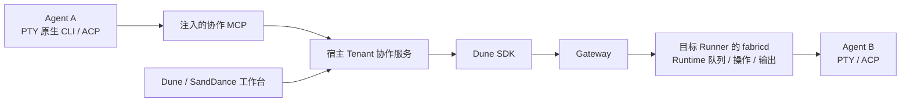
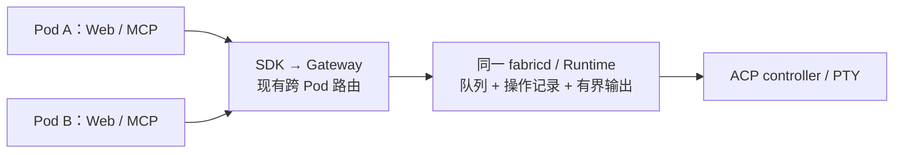

# herdr 借鉴方案：Dune / SandDance 工作台与 Tenant Agent 通信

> 历史调研 / 实施记录：2026-09-18 已收窄范围。当前实现以 [存储精简方案](../herdr-simplification.md) 为准；下文退出恢复、持久已读、六张新增表等内容不再属于当前目标，旧验收缺口不阻塞精简目标。

> 更新：2026-09-17。配套来源：[herdr 源码调研](reference-project-analysis-herdr.md)。产品范围已通过设计访谈确认；本文据此给出实现方案、职责划分与验收要求。实施进行中，已交付范围与验证记录见 [实施清单](../herdr-implementation.md)。本文源码事实为方案形成时的基线，当前 API 以实施文档为准。
>
> 方案重点是 PTY / ACP 双核心入口、Tenant 范围自由分屏与 MCP 协作，以及保存在应用数据库中的个人工作现场。API 命名和表结构是实现建议，不能视为已存在的接口。

## 1. 已确认的方向

| 决策 | 已确认内容 |
| --- | --- |
| 优先级 | 先管理多个 Agent：状态、关注、切换、比较；再降低启动摩擦；随后完成 Agent 协作 |
| 两种入口 | 原生 CLI 的 PTY 与 ACP 都是核心入口，均纳入列表、分屏和恢复体验 |
| 两个产品 | Dune 个人 Web 和 SandDance 都交付通用能力；Dune 提供共享能力，SandDance 接企业身份与环境管理 |
| 工作区 | 项目工作区可以关联多个 Runner 上的 checkout / worktree，不只是一台 Runner 的目录 |
| 通信范围 | Tenant 内共享、跨 Runner；项目用于组织工作，不作为 Agent 通信的授权边界。Dune 个人模式使用个人 Owner 范围 |
| 权限 | 首版保留 Tenant 边界，不增加项目成员、Agent 角色等复杂权限模型 |
| 协作方式 | Agent 可发现其他 Agent、投递任务、等待和读取结果；主 Agent 可自行创建助手、分工和协调 |
| 工具入口 | 自动注入 MCP，取消协作 CLI 方案 |
| 自动注入覆盖面 | 首版覆盖从工作台或 MCP 创建的 PTY / ACP Agent；不自动改造普通终端里手动启动的 Agent |
| 分屏范围 | 同一布局可以自由组合 Tenant 内任意 Agent，允许跨项目、跨 Runner |
| 个人工作现场 | 布局、焦点和已读记录按用户保存在应用后端数据库；同一部署、同一账号与 Tenant 下跨浏览器恢复 |
| 对象与任务 | 参考 herdr 的存活会话寻址和控制原语；不以永久 Agent 角色、Task / DAG 系统作为前置条件 |
| 忙时投递 | PTY 参考 herdr，由原生 CLI 决定工作中收到输入的行为；ACP 接受为 pending，当前 turn 结束后再发送，不隐式中断 |
| 队列归属与寿命 | 每个 Runtime 的队列与操作记录由 fabricd 持有；宿主 Pod 重启不清空队列，fabricd 实例失效后旧引用失效 |
| 会话恢复 | 数据库保存原生会话恢复索引与原启动配置；存活会话自动重连，失效会话点击“继续”后恢复指定原生会话 |
| PTY 人工输入 | 参考 herdr 直接投递；文本与 Enter 有序提交，不增加人工接管 / 交还操作 |
| 助手运行位置 | 先使用已有且就绪的 Runner，不自动创建云环境 |
| 文件位置 | 用户可以选择当前目录或 worktree，不强制 worktree |

“Agent”在这里首先是一个可定位的运行会话。显示名称用于阅读，工具返回具体会话引用供后续调用；退出、替换后的同名会话不能接收旧调用。不引入额外的永久角色身份。

## 2. MCP 方案建议

MCP 把控制能力提供为 Agent 可发现的工具。共享宿主服务负责身份、Tenant 聚合、目标解析和 MCP；fabricd 管理每个 Runtime 的队列、操作与输出，两个产品通过同一 SDK 合同调用。本文的“宿主”指 Dune 个人 Web 后端或 SandDance 后端。

这里的 MCP 服务是 Tenant 范围的控制入口，不把每台 Runner 做成互相不可见的协作空间。一个宿主可以承载多个 Tenant，请求的 Tenant 从认证上下文取得，不能由模型随意传入。两个产品共享实现，不要求它们共用同一个部署。

### 2.1 工具表面

以下工具名是建议，尚非已实现 API。参数与返回值保持简单，任务正文使用普通文本。

| 工具 | 作用 | 返回语义 |
| --- | --- | --- |
| `runners_list` / `profiles_list` | 发现本 Tenant 可用的 Runner 与 Agent 启动配置 | 明确就绪状态以及 PTY / ACP 能力 |
| `agents_list` / `agents_get` | 发现 Agent，获取项目、Runner、活动状态和会话引用 | 摘要，不默认返回所有会话的完整内容 |
| `agents_start` | 在既有且就绪的 Runner 启动助手，选择 Profile 和当前目录 / worktree | 新会话引用及准备状态，不创建云环境 |
| `agents_prompt` | 向明确的会话发送文本，可附等待条件 | 返回 `operation_ref` 与状态；ACP pending 已有操作引用，尚未产生本次执行的输出 |
| `agents_wait` | 有界等待一个操作，或明确选择会话活动观察 | `operation_ref` 等待该操作；`agent_ref` 只观察会话活动。两种选择互斥，不能用会话 idle 代替操作完成 |
| `agents_read` | 读取一个 ACP 操作的输出，或明确读取会话快照 | 按本操作的位置读取有界输出，返回下一位置与完整性标记；PTY 使用会话快照 |
| `agents_send_keys` | 对 PTY 原生交互发送按键，参考 herdr | 面向当前终端；不把普通任务文本自动送进交互提示 |

主 Agent 组合这些工具完成“找助手 → 启动 → 分工 → 等待 → 读取 → 汇总”。工具描述需要解释 PTY 与 ACP 的不同结果保证：`wait` 观察到空闲不证明某条 PTY prompt 已处理；任务是否成功仍需查看结果。

### 2.1.1 操作引用、等待与输出合同

`operation_ref` 是 fabricd 为一次已受理操作生成的不透明引用，内部绑定原 fabricd / Runtime 执行身份与操作 ID。调用方保存并原样传回即可，不需要理解宿主 Pod、协调任期或全局事件流。操作记录和每操作的有界输出缓冲都保存在 fabricd 内存。

首版 prompt 操作接口暴露以下信息，读取响应另外包含实际输出内容与错误说明；成功的 new/load 额外返回已确认的 `native_session`（ID、cwd、版本与恢复能力；内部确认序号用于防止迟到记录覆盖），供恢复索引采集：

| 字段 | 含义 |
| --- | --- |
| `operation_ref` | 定位一个操作，供 prompt 的返回值及后续 wait / read 使用 |
| `state` | ACP 为 pending、running、completed、failed、cancelled 或 unknown；PTY 投递成功为 delivered |
| `stop_reason` | ACP 匹配的 prompt RPC 返回的结束原因；尚未结束时为空 |
| `position` | 本次读取在该操作输出中的位置，首次从 0 开始 |
| `next_position` | 后续读取应传入的位置；仅在本操作内使用，无需计算全局事件序号 |
| `incomplete` | 是否存在被截断、淘汰或无法可靠归属的输出；false 只表示已产生输出没有已知缺口，不表示操作已经结束 |

`agents_prompt` 返回操作引用与当前状态。`agents_wait(operation_ref, timeout_ms)` 等待该操作；超时返回其当前状态，不取消操作。`agents_read(operation_ref, position, limit)` 返回状态、stop reason、输出内容、实际读取位置、下一位置和完整性标记。会话活动观察与快照读取仍可显式使用 `agent_ref`，不能隐式替代操作模式。

**ACP 按操作保存输出。** fabricd 在受理时创建操作记录、在发送前建立 `operation_id ↔ ACP JSON-RPC id` 映射。该 Runtime 的 managed `new/load/prompt` 入口统一串行，更新写入当前操作的缓冲；匹配的 RPC 响应到达后，记录结果和 stop reason、关闭本次输出，再启动下一项。结束边界是内部实现，调用方无需传递起止游标或流 epoch。[C08]

对当前操作的 permission / cancel 控制沿用 ACP controller 的即时处理路径，校验当前目标后处理，不排在等待该操作结束的普通 prompt 后面。

例如 A 正在执行，B 返回 pending：A 的完成只满足 A 的等待；读取 B 返回 pending 和空输出，位置仍为 0。B 自己开始后才产生 B 的输出。`agents_prompt` 的可选等待也只能等它刚返回的操作引用。

缓冲在 fabricd 发布订阅事件前更新，浏览器或宿主丢失订阅后可按操作位置补读。若请求的位置已经被裁剪，返回仍保留的内容、实际起点和 `incomplete=true`；位置不因裁剪而重新编号。整条操作记录已淘汰或原执行实例失效时明确返回过期 / 失效，不降级读取当前会话最新输出。每操作输出、每 Runtime 操作数量和完成记录保留时间均有界。

`load` 的历史重放单独处理，不混入下一条 prompt 的输出。ACP update 没有通用的逐请求 ID，归属依赖协议的有序 turn 边界和 Dune 严格串行；无法可靠归属时标记不完整，不把未知通知强行当成某条操作的结果。完成只依据匹配的 RPC 响应，不能凭后来 idle 补记成功；正常结束也不代表业务任务验收通过。

**PTY 保留原生语义。** 操作引用仅记录文本与 Enter 的投递，delivered 不代表任务完成。观察 Agent 活动及读取终端结果使用 `agent_ref`，不提供伪精确的逐 prompt 输出归属。

### 2.2 两种启动形态如何注入

| 形态 | 建议实施路径 | 当前代码事实 |
| --- | --- | --- |
| managed ACP | 在 `session/new` 和 `session/load` 传入本次会话的 MCP 配置；按 Agent 能力选择 transport | 当前两处 `mcpServers` 都为空；未解析 MCP transport 能力 [C01] |
| 通过 Profile 启动的 PTY | Agent 启动适配器生成本次启动配置，并通过该 Agent 支持的参数、配置文件或环境传入 | Profile 已有 argv / env / cwd；没有现成的厂商 MCP 适配。不能认为所有 CLI 都认识同一环境变量 [C02] |
| 任意终端里手动启动 Agent | 首版不自动注入 | 已运行进程不会因为更新 Profile 就得到新 MCP；需要单独的原生集成 |
| 原始 ACP 透传 | 调用方自行提供 MCP 参数；首版不在协议透传中隐式合并配置 | 当前允许调用方自行发送包含 MCP 配置的 JSON-RPC params，不会自动合并；Web 使用 managed ACP [C03] |

建议宿主提供 MCP HTTP 接入；支持该 transport 的客户端可以直连，只支持 stdio 的客户端由自动启动的 MCP bridge 转接。bridge 是内部传输组件，Agent 看到的是 MCP tools，无需在 shell 中拼接协作命令。transport 选择由适配器和能力检查完成。

**这条接入链路需要新增实现。** 两仓库当前没有 MCP server、bridge 或 Agent MCP 会话凭据。Gateway 会关闭 daemon 主动打开的额外 yamux stream，不能把现有反向隧道当成任意 Runner → 宿主 API 的代理。建议先新增独立 HTTP 接入并验证 Runner 可达性；Runner 已在线不代表它能访问宿主的 PublicURL。[C04]

MCP 凭据绑定当前 Tenant 与调用会话，权限以 Tenant 共用为起点，生命周期由宿主管理。凭据只进入本次启动配置，不保存回通用 Profile。ACP 当前把完整发送 JSON 发布到 inspector，新增 MCP header / env 时必须同步做凭据脱敏或使用凭据引用。[C05]

### 2.3 投递与浏览器输入的关系

MCP 替换工具入口，不会自动解决底层输入竞争。

- **PTY：** 当前浏览器 attach 占有连接级输入权，空闲也不会释放。需要 fabricd 统一协调浏览器键盘和 Agent prompt 输入；文本与 Enter 作为一组处理，保留完整目标和实例校验。仅在宿主加锁或直接调用 `tmux send-keys` 不足以解决问题。[C06]
- **PTY 状态：** 投递前检查当前前台仍是目标 Agent；已 blocked 时按 herdr 拒绝普通 prompt。工作中可投递，但不把当前旧 turn 的结束当成新任务完成。
- **ACP：** 在 fabricd 的每个 Runtime 内新增 pending 队列；Web、MCP 和其他 managed 入口遵循同一串行规则。当前实现忙时直接拒绝，需要明确修改。队列在 fabricd 存活期间有效，宿主 Pod 重启不影响已受理操作。[C01]
- **断线：** 未收到结果不能等同于未执行；已经开始投递且结果未知的请求不自动重放。MCP 请求 ID 也不天然提供持久幂等保证。

队列在持有 Runtime 的 fabricd 中统一受理；宿主 Pod 不另建队列，也不自行重排待发消息。现有 busy 检查需要扩展为实际的入队与出队逻辑，具体生命周期见第 2.4 节。

fabricd 重启后不保留旧 pending 的正文和状态，持有旧引用的调用方能够识别失效。队列容量和等待时长均有界，满载明确拒绝，避免无限堆积。

**人工输入参考 herdr。** API prompt 与人工按键进入统一输入队列，一次 submission 在文本和延迟 Enter 写完前不插入后续人工按键；不增加人工接管 / 交还操作。这个机制保证提交顺序，不隔离已进入原生 CLI 输入框的草稿；已有草稿可能与新文本一起提交，具体行为由原生 CLI 决定。herdr 的源码也没有草稿检测、保存或恢复。[H30] [H31] [H32]

### 2.4 队列归属与跨 Pod 调用

**每个 Runtime 的队列、操作记录和有界输出缓冲放在 fabricd。** fabricd 已独占 Runtime 并持有 ACP controller；在这里串行受理和执行请求，所有宿主 Pod 自然汇入同一个队列。宿主负责身份、Tenant 聚合和 MCP，提交、wait、read 统一走现有 SDK / Gateway 链路。

SandDance 已使用共享 PostgreSQL 和直接到 Pod 的 mTLS peer 连接，Dune Gateway 已能按 Runner 连接归属转发请求。复用这条执行路由，不再为队列增加宿主协调目录、选主、租约、协调任期或内部转发服务。[C09] [C10]

fabricd 按实际受理顺序入队；不同 Pod 的墙钟到达顺序不是承诺。所有 managed 的普通 new / load / prompt 都经过同一个 Runtime 队列，读取和等待直接查询该 Runtime 的操作记录。某个 Pod 的缓存或订阅只服务展示，不成为另一份队列或结果真相。

| 事件 | 队列与操作的行为 |
| --- | --- |
| 浏览器关闭或宿主 Pod 重启 | 已受理队列和正在执行的操作继续；换一个 Pod 仍可通过同一 operation_ref 查询，前提是记录未超出保留窗口 |
| Gateway 连接重建 / 路由变化 | 经现有机制重连并核验原 fabricd / Runtime 身份；不因路由改变复制队列或重放 prompt |
| fabricd 重启 | 内存队列、操作记录和输出缓冲失效；即使 tmux 中 PTY 仍存活，旧操作引用也不能作用于新 fabricd 实例 |
| Runtime 被销毁或替换 | 对应队列和引用失效；普通进程退出则终止未完成操作，已有记录只在有界保留窗口内可读 |
| 提交后未收到回执 | 受理结果未知，不自动重放。已有操作引用可查询；没有引用时不能从会话 idle 推断未执行 |

MCP 连接断开后可以重新建立协议会话，再用原 operation_ref 查询；重连本身不提交新的 prompt。操作引用的寿命独立于 MCP 连接。

授权与实例校验保留：每次提交 / wait / read 都经宿主身份与 Tenant 校验及 Gateway 访问检查，fabricd 在受理与出队时复核目标 Runtime 和 ACP session。出队执行的是已受理操作，不依赖提交 Pod 的 HTTP / SDK 连接持续存活；原 session 被切换时，绑定旧 session 的 pending 明确失效。

现有 Gateway 路由和输入租约继续保护连接与写入准入；操作引用绑定执行实例，不绑定某个宿主 Pod 或临时 Gateway 路由。队列满时明确拒绝，fabricd 失效后不恢复旧 pending，也不把引用失效解释成“确定没有执行”。

## 3. 工作台与开箱体验的建议

沿用 herdr 的两类导航：项目回答“在哪里工作”，Agent 列表回答“谁正在工作、谁需要回应”。PTY 与 ACP 使用同一套列表和 pane 容器，各自保留原生终端或对话渲染。

布局独立于 Runtime 和项目，支持水平 / 垂直分屏、调整大小、聚焦和移出视图；移出视图不停止 Agent。已确认同一布局可以自由组合 Tenant 内任意 Agent。

据此区分两个对象：`ProjectWorkspace` 保存 Tenant 共享的项目及其在不同 Runner 上的目录；`WorkbenchView` 保存用户个人的一套工作台布局，pane 分别引用自己的项目、Runner 与会话。项目筛选和工作台布局分开，切换项目不隐式清空已有分屏。布局、焦点和已读记录保存在应用数据库，换浏览器可以恢复，同事使用自己的工作现场。

每个 pane 的标题明确显示项目、Runner 和 Agent。文件 / Git 默认跟随焦点 pane，并显示对应目录和分支；允许用户固定审阅目标，固定时保留醒目标识。Agent 状态变化不抢焦点。同一 Runtime 复用执行 controller，重复打开采用观察视图或定位原 pane，不创建互相争抢 resize 与输入权的控制连接。

保存项目、常用 Profile、目录和布局，提供直接继续入口。重进页面先核验实际 Runtime，仍存活的会话直接重连；失效会话只有在恢复索引完整时提供“继续”，用户点击后用记录的原启动配置恢复指定原生 session。恢复索引缺失或能力不支持时明确显示原因，并提供新建入口。布局恢复不重放原任务 prompt，用户明确停止的 Agent 不因浏览视图而自动启动。索引字段与采集时机见第 5.1 节。

活动状态与进程状态分开；PTY 的前台识别、hook / manifest 是首批核心能力的一部分，未支持的 Agent 保留 unknown。用户已读状态与 Agent 活动分开保存；一个用户读过结果，不会替其他用户标记已读。

建议首版通过文本任务和 `agents_read` 输出完成协作闭环；跨 Runner 的文件引用必须包含 Runner 和路径，不把相同路径视为共享文件系统。自动文件同步、完整对话历史归档、持久任务编排另行按实际需求确定。

## 4. 实施拆分与验收建议

交付顺序遵循已确认的“管理多个 Agent → 降低启动摩擦 → Agent 协作”。各阶段均覆盖 Dune 个人 Web 与 SandDance，底层能力共同复用。

| 阶段 | Dune 共享能力 | Dune 个人 Web / SandDance | 验收重点 |
| --- | --- | --- | --- |
| P1：并行工作台 | PTY / ACP 活动摘要、目标会话引用、快照与增量；PTY 状态适配 | 项目入口、Tenant Agent 列表、任意 Agent 分屏、个人布局与已读落库、文件 / Git 跟随 | 四个 Agent 混合 PTY / ACP，跨两个项目与两个 Runner 同屏；焦点、输入和审阅目标始终一致；换浏览器恢复个人布局 |
| P2：启动与恢复 | worktree 能力、启动检查、原生恢复索引与固定启动配置 | 项目默认项、当前目录 / worktree 选择、继续工作和恢复布局 | Profile 修改后仍恢复原会话；支持 load 但不支持 list 时可直接恢复；索引缺失不会假称可继续 |
| P3：Tenant MCP 协作 | MCP 服务与注入、fabricd Runtime 队列、ACP 操作关联与有界输出、PTY 输入协调 | 展示操作进度、pending 与失效；接入各自 Owner / Tenant 身份 | 不同 Pod 经现有链路命中同一 fabricd 队列；B 的等待和输出不被 A 满足；宿主重启后操作仍可查询 |

共享宿主服务负责身份、Tenant 聚合和 MCP，Dune 个人 Web 与 SandDance 分别装配数据库和 Profile。Gateway 负责现有路由与访问检查，fabricd 负责 Runtime 队列、操作状态、有界输出、活动检测与输入准入。

建议额外覆盖以下回归场景：

- **只观察部分会话：** 全局列表通过摘要更新，不为所有 Agent 打开完整内容流；隐藏 pane 不发送零尺寸 resize。
- **浏览器关闭：** 后台 Agent 和已受理的 ACP pending 继续运行；再次进入核验 Runtime 后恢复显示。
- **宿主与 fabricd 分别重启：** 宿主 Pod 重启后已受理队列和操作仍可查询；fabricd 重启后旧引用失效，不自动重放未知操作。
- **Runner 或 Runtime 替换：** 旧工具目标、视图和等待终止或显示失效，不能作用于新实例。
- **MCP 就绪：** 检查 Runner 到 MCP 接入的可达性；工作台和 MCP 创建的 Agent 均取得工具。普通终端手工启动不声称已自动注入。
- **输出读取：** 按指定操作的位置读取 fabricd 中的有界输出；超过保留窗口或来源不可读时明确返回缺口，不以空输出冒充完整结果。
- **权限与凭据：** Tenant 内可跨项目、跨 Runner 协作；越 Tenant 拒绝。Profile 模板和 ACP inspector 不泄露本次会话凭据。
- **目录选择：** 当前目录与 worktree 两条路径均可用；移出 pane 不删除 checkout，清理脏 worktree 有明确提示。
- **失效会话：** 打开布局只重连存活会话；失效项等待用户点击“继续”，不会自动重启或重发任务。
- **PTY 输入顺序：** 并发输入时验证自动 prompt 的文本、延迟 Enter、后续人工按键的顺序；不宣称提供原生 CLI 已有草稿隔离。
- **个人数据库记录：** 换浏览器登录同一账号恢复布局与已读；另一个用户的读取不改变自己的已读状态。应用后端重启后个人设置仍在，ACP pending 的寿命独立于应用后端。

实施前必须把以下三组场景纳入合同测试与集成验收；当前仅定义要求，未运行这些验证：

| 问题 | 必须覆盖的场景与结果 |
| --- | --- |
| 跨 Pod 正常路由 | Web 落到 Pod A、MCP 落到 Pod B；提交经 SDK / Gateway 汇入同一 fabricd 的 Runtime 队列，在 A / B 查询和等待均取得同一操作记录 |
| 宿主重启与路由重建 | Pod A 重启时，fabricd 已受理的 pending 和执行继续；在 Pod B 使用原 operation_ref 取得结果。Gateway 重连不复制队列或补发 prompt |
| fabricd 重启 | 旧操作引用失效、旧 pending 不恢复；PTY 即使经 tmux 继续存活，也不能拿新 fabricd 的状态冒充旧操作结果 |
| ACP A / B 关联 | A 执行中 B 返回 pending；A 完成只满足 A 的等待，B 读取为 pending 和空输出。B 开始后缓冲只保存 B 的输出，完成返回 B 的 stop reason |
| ACP 事件边界 | 极快响应、load 历史重放、权限等待与缓冲淘汰分别验证；宿主丢订阅后可在保留窗口内补读，缓冲裁剪后返回实际位置与 incomplete=true |
| 操作引用寿命 | 等待超时不取消操作；读取位置在同一操作内递进；旧 fabricd 实例和已淘汰操作明确失效，不降级读取“当前会话最新内容” |
| 原 Profile 已修改或删除 | 使用 Profile 修订 3 加一次启动覆盖项创建会话，再修改默认 Profile 或删除来源；继续时仍使用保存的实际启动快照、原 cwd 和原生 session ID，不重新从 Profile 取配置 |
| load 与 list 独立 | Agent 广告 load=true、list=false，索引已有原生 ID；恢复直接调用 load，不要求先 list，也不退化为 new |
| 恢复索引异常 | PTY 未采集到原生 ID、索引保存失败、原生会话文件丢失、凭据引用失效或 Runner 更换均有明确状态；不会猜最近会话或改用项目最新 Profile |
| 并发点击继续 | 两个 Pod / 浏览器同时恢复同一索引，只产生一个受理的恢复 attempt；启动结果未知时不自动创建第二个 Runtime |

多 Pod / 故障注入测试需要共享数据库、至少两个入口实例和一个真实或可控 fabricd；PTY / ACP 互操作另以宣称支持的实际 Agent 验收。文档检查不能代替这些验证。

## 5. 数据库存储与运行状态

数据库保存项目元数据、个人工作现场和原生会话恢复索引。Dune 若部署在本机，记录可以留在本机应用数据库；SandDance 多 Pod 共用应用数据库。Runtime 队列、操作记录和有界输出保存在 fabricd 内存，不新增宿主队列协调表。

以下是建议的数据划分，实际表名按两个产品的数据库规范确定：

| 数据 | 归属与内容 | 保存方式 |
| --- | --- | --- |
| 项目工作区 | Tenant / Owner、名称、默认 Profile、多个 Runner 目录引用 | 应用数据库；项目在 Tenant 内共享 |
| 项目目录 | 项目、Runner、cwd、可选 worktree 来源 | 应用数据库；使用前核验当前 Runner 及目录，不把相同路径当作同一 checkout |
| 工作台布局 | Tenant / Owner、用户、布局 ID、pane 树、比例、焦点 pane、固定审阅目标、修订号 | 应用数据库；每个 pane 保存具体会话引用，可跨项目和 Runner |
| 已读记录 | Tenant / Owner、用户、目标实例、活动事件的 epoch / seq | 应用数据库；同一事件域内只向前更新，不把新实例复用的序号当成旧事件 |
| 原生会话恢复索引 | 原生 ID、Agent 与恢复适配器、实际启动快照、cwd、Runner 与存储归属、最后 Runtime；Profile ID / 修订记录来源 | 应用数据库；实际快照是恢复配置的唯一依据，不依赖来源 Profile 的当前内容，也不替代原生会话文件 |
| Agent 摘要与 PTY 快照 | 当前 Runtime 的活动、连接状态及现有终端画面 | fabricd 状态及 tmux 终端能力；宿主缓存仅用于展示，不承诺完整历史归档 |
| Runtime 队列与操作记录 | 目标会话、输入、operation_ref、状态、stop reason、每操作输出缓冲与保留期限 | fabricd 内存；宿主 Pod 重启不影响，原执行实例失效或保留窗口结束后不可继续查询 |

布局可按二叉分屏树保存：叶子是 pane，内部节点记录水平 / 垂直方向、比例和两个子节点。浏览器自动保存个人视图，使用修订号处理并发更新；另一个窗口的保存不强制切换当前焦点。已读记录只表达用户看过哪些活动，不等同于保存这些活动的完整正文。

恢复流程为：读取个人视图与已读记录 → 获取 Tenant 当前 Agent 摘要 → 校验每个 pane 的目标实例 → 重连存活会话、标出失效项 → 用户点击继续后读取恢复索引并发起原生恢复。pane 同时引用恢复记录和最后 Runtime；恢复记录只定位原生会话，不自动取得输入权，也不让旧操作引用指向新的执行。

herdr 的默认行为有所不同：冷恢复时有受支持且有效的 native session 引用，就自动调度 resume；没有可用引用时重建 shell 并恢复已保存的屏幕历史。本方案采用已经确认的“失效项点继续”，同时借鉴它的恢复能力识别方式。[H33] [H34]

### 5.1 原生会话恢复索引

每个由工作台或 MCP 启动并识别出的原生会话，保存一条恢复记录。记录用于重新找到同一个原生 session，不表示永久 Agent 角色，也不保存任务 DAG 或 prompt 正文。

| 字段组 | 保存内容 |
| --- | --- |
| 会话与适配器 | `session_record_id`、Agent 类型、PTY / ACP 形态、恢复适配器 ID 与配置版本、已识别 Agent 版本 |
| 原生定位 | `native_session_id`、必要的适配器恢复元数据、会话存储所在 Runner / 执行用户或存储命名空间、采集来源 |
| 原启动配置 | 应用启动覆盖项后的不可变配置快照，包含实际命令配置、非敏感环境、凭据引用、cwd；原 Profile ID 与修订号仅记录来源，自定义启动可无 Profile 来源 |
| 执行归属 | Tenant / Owner、项目、原 Runner、原 binding / checkout 或 worktree 引用、最后确认的 Runtime 身份 |
| 状态与采集 | 恢复能力、`pending_capture / available / unavailable / unknown`、不可用原因、确认时间、记录修订号、最近恢复 attempt 与已知结果 |

**实际启动配置快照是恢复配置的唯一依据。** Profile ID / 修订仅记录来源，恢复时不再读取该修订，也不与快照合并。来源 Profile 修改或删除不更新、不删除已有快照；项目默认 Profile 只用于新会话。现有修订机制可用于首次启动时确定输入，随后以应用全部覆盖项后的快照为准。[C11]

快照保留恢复所需的启动配置，首条任务单独投递，不进入恢复索引。恢复适配器据快照构造显式 resume 启动，不原样重跑一次性新建参数、首条 prompt 或项目初始化脚本；自定义启动方式无法可靠区分这些部分时，标记不支持自动恢复。

启动快照不冻结一次性 MCP token；恢复时重新签发。敏感配置使用凭据引用或受保护的存储方式，不能为避免记录敏感值而删掉必需参数后仍声称配置可重现。所需凭据或程序版本不可用时，标记恢复前置条件不满足，不静默改用最新配置。

**采集与更新时机：**

1. 启动前解析所选 Profile 或自定义配置、cwd、Runner 和全部覆盖项，先写入实际启动快照、来源信息及 `pending_capture` 记录。启动确认后关联返回的 Runtime；启动回执未知时记录 unknown，不自动重发 start。
2. managed ACP 在 `session/new` 成功返回原生 session ID 后保存索引；`session/load` 在成功响应后保存所请求且已确认加载的 ID。不能仅凭发送 load 参数或后续 busy=false 就标记可恢复。ACP 当前分别广告 load 和 list 能力，恢复已知 ID 不要求 list。[C12]
3. PTY 由该 Agent 的 hook / integration / 适配器采集原生 ID，并带启动 attempt 与 Runtime 上下文；后端核对来源后更新。未采集到 ID 时保留不可恢复状态，不能从终端标题或“最近一个 session 文件”猜测。
4. 同一个 Runtime 切换到另一个原生 session 时，为对应原生会话选择或创建另一条恢复记录，再更新 pane 关联，不覆盖原记录的原生 ID 和启动来源。已确认会话的 native ID、配置和执行归属保持一致；旧 Runtime 的迟到上报不能覆写恢复后的新 attempt。
5. 数据库写入成功后才对外标记 `available`。索引保存失败时，现有 Agent 可以继续运行，但 UI 明示暂不可恢复；可以重试保存同一个已确认 ID，不能重做 session/new 来“补索引”。Runtime 消失前仍未取得可靠 ID，就只能显示不可恢复。

**用户点击“继续”：**

1. 从 pane 的 `session_record_id` 读取索引，校验 Tenant、记录修订、原 Runner / 原生存储仍可用及恢复适配器能力。恢复索引不备份 Agent 自己的 session 文件；Runner 重建后不能仅凭路径相同就假定文件还在。
2. 按恢复记录取得一次恢复 attempt 的唯一执行权，并在数据库记录 attempt ID；不同 Pod 的重复点击返回同一已受理 attempt。已发出启动但结果未知的 attempt 不自动由另一 Pod 重试。
3. 使用原启动快照与新签发的运行凭据启动对应 Agent。ACP 确认支持 load 后，直接以保存的 native session ID 和原 cwd 调用 load；只有 list 而没有 load 不能用于继续。PTY 使用记录的恢复适配器与原生 ID，不使用含义随时间变化的“恢复最近会话”。
4. 成功确认加载同一原生会话后，更新最后 Runtime 与 pane 的运行引用。新的运行实例有新的操作与队列引用；旧 pending 不恢复。若原生 ID 找不到或配置无法满足，明确返回恢复失败，提供新建入口，不偷偷执行 new。

恢复 attempt 的状态只解决同一次“继续”的跨 Pod 重复启动与结果未知问题；它属于会话恢复元数据，不承担持久消息排队或自动任务重试。

## 6. 代码职责与实施入口

| 位置 | 实施工作 |
| --- | --- |
| Dune `pkg/host/` | 提供身份与 Tenant Agent 聚合、MCP 工具和目标解析；通过 SDK 调用 fabricd 的 submit / wait / read，扩展执行入口以支持 PTY |
| Dune `pkg/fabricd/` 与 `internal/tmux/` | 持有 Runtime 队列、操作记录与有界输出；在 ACP RPC 响应处结束操作；统一 PTY 输入，保留实例检查并采集原生恢复信息 |
| Dune `pkg/api/`、SDK 与协议定义 | 表达活动摘要、Agent / 操作引用、状态、stop reason、操作内读取位置与完整性、恢复信息及 worktree 能力；同步全部调用方 |
| Dune 个人 Web 后端 / SandDance 应用后端 | 装配身份、数据库与 Profile；保存个人视图和恢复索引，以实际启动快照恢复；去重并发恢复 attempt，签发本次会话凭据 |
| Dune `web/src/` / SandDance 工作台 | 将单一选中会话视图拆成独立 pane 与共享 controller；加入全局 Agent 列表、自由分屏、焦点审阅联动和个人设置自动保存 |

实现前需要为计划支持的每一种 Agent 验证其 MCP 配置格式、状态来源、终端投递与原生 resume；当前调研没有运行这些互操作测试。既有代码事实与新增设计应始终区分，不能把 MCP 配置字段存在等同于端到端协作已可用。

## 7. 本轮核对的源码证据

下列事实为本地源码只读核对；未执行真实 MCP / Agent 验证，也未验证各厂商 CLI 当前版本的配置格式。

- [C01] ACP 握手、busy 拒绝及 new / load 的 MCP 配置：[acp.go](/Users/bytedance/Workspace/aiomni/dune/pkg/fabricd/acp.go:344)。
- [C02] Profile 启动字段：[types.go](/Users/bytedance/Workspace/aiomni/dune/pkg/api/types.go:40)；PTY 启动环境：[tmux.go](/Users/bytedance/Workspace/aiomni/dune/internal/tmux/tmux.go:196)。
- [C03] 原始与 managed ACP 的输入规则：[runtime.go](/Users/bytedance/Workspace/aiomni/dune/pkg/fabricd/runtime.go:811)；Web managed 启动：[server.go](/Users/bytedance/Workspace/aiomni/dune/internal/webapp/server.go:551)。
- [C04] Gateway 拒绝 daemon 额外 stream：[daemon.go](/Users/bytedance/Workspace/aiomni/dune/pkg/gateway/daemon.go:144)；宿主独立 PublicURL：[app.go](/Users/bytedance/Workspace/aiomni/dune/pkg/host/app.go:47)。
- [C05] ACP 输入诊断流：[acp.go](/Users/bytedance/Workspace/aiomni/dune/pkg/fabricd/acp.go:92)；Profile 保存：[store.go](/Users/bytedance/Workspace/aiomni/dune/pkg/profiles/store.go:39)。
- [C06] PTY 浏览器取得输入权：[server.go](/Users/bytedance/Workspace/aiomni/dune/internal/webapp/server.go:640)；订阅所有者互斥：[runtime.go](/Users/bytedance/Workspace/aiomni/dune/pkg/fabricd/runtime.go:170)。
- [C07] 宿主执行 Scope：[agent_executor.go](/Users/bytedance/Workspace/aiomni/dune/pkg/host/agent_executor.go:17)；SandDance Tenant 校验：[access.go](/Users/bytedance/Workspace/aiomni/SandDance/internal/tenant/access.go:13)。
- [C08] ACP 内部 RPC ID 与流事件：[acp.go](/Users/bytedance/Workspace/aiomni/dune/pkg/fabricd/acp.go:102)；session/update 发布：[acp.go](/Users/bytedance/Workspace/aiomni/dune/pkg/fabricd/acp.go:252)；异步 action 完成：[acp.go](/Users/bytedance/Workspace/aiomni/dune/pkg/fabricd/acp.go:501)。
- [C09] SandDance 共享 PostgreSQL / Cluster 装配：[app.go](/Users/bytedance/Workspace/aiomni/SandDance/internal/app/app.go:250)；直接 Pod 地址与 mTLS 配置：[cluster.go](/Users/bytedance/Workspace/aiomni/SandDance/internal/app/cluster.go:48)。
- [C10] Dune 现有 Runner 连接目录：[cluster.go](/Users/bytedance/Workspace/aiomni/dune/pkg/host/cluster.go:16)；数据库目录 CAS / 租约：[directory.go](/Users/bytedance/Workspace/aiomni/dune/internal/metadata/directory.go:107)；Gateway 归属续租：[ownership.go](/Users/bytedance/Workspace/aiomni/dune/pkg/gateway/ownership.go:116)。
- [C11] Profile 修订表与实际配置：[store.go](/Users/bytedance/Workspace/aiomni/dune/pkg/profiles/store.go:73)；固定修订读取：[store.go](/Users/bytedance/Workspace/aiomni/dune/pkg/profiles/store.go:150)。
- [C12] ACP load / list 独立能力：[acp.go](/Users/bytedance/Workspace/aiomni/dune/pkg/fabricd/acp.go:344)；new / load session ID 处理：[acp.go](/Users/bytedance/Workspace/aiomni/dune/pkg/fabricd/acp.go:453)。

[H30]: https://github.com/herdrdev/herdr/blob/e7e3dfa60e359404def46503dd105c165d02a561/src/app/api/agents.rs#L146
[H31]: https://github.com/herdrdev/herdr/blob/e7e3dfa60e359404def46503dd105c165d02a561/src/app/api_helpers.rs#L25
[H32]: https://github.com/herdrdev/herdr/blob/e7e3dfa60e359404def46503dd105c165d02a561/src/pty/actor/unix.rs#L580
[H33]: https://github.com/herdrdev/herdr/blob/e7e3dfa60e359404def46503dd105c165d02a561/src/config/model.rs#L265
[H34]: https://github.com/herdrdev/herdr/blob/e7e3dfa60e359404def46503dd105c165d02a561/src/persist/restore.rs#L739
