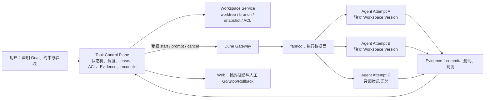

# Dune 多 Agent 协作调研：从 TiDB “薄 Agent Loop，厚 Control Plane”出发

> 调研日期：2026-09-08。Dune 基线：`055c78a64c2868531065d8c9d9d00a450fc796ea`。来源：Tina，《“薄 Agent Loop，厚 Control Plane”：TiDB 用数据库思维重做 Harness》（用户提供全文）。关联：[个人 Web 方案](../personal-web-plan.md) · [DeepSeek Harness 调研](reference-project-analysis-deepseek-harness.md) · [参考项目索引](README.md)。

## 结论

**Dune 实现多 Agent 的正确切入点不是 Agent 间即时通信，而是把 Dune 从“可远程启动 Agent 的执行层”逐步补成一个以 Workspace、任务状态、权限和证据为核心的 Control Plane。** Agent Loop 保持可替换、短生命周期且职责单一；各 Agent 在隔离工作区中探索，通过版本化状态、明确 Input/Output、可验证 Evidence 和少量异步事件协作。

这与 TiDB 的思路有直接对应：TiDB Cloud Filesystem 将 Workspace 从 Session/Sandbox 中独立出来，用数据库提供版本、分支、回滚和权限；Dune 应将 Runtime/ACP Session 视为可失效的计算尝试，而非工作状态本身。当前 Dune 的 Gateway/fabricd 是执行数据面；`internal/metadata` 中的 SQL 事务、租约、revision、幂等动作、unknown 状态和授权检查，则是构建任务 Control Plane 的可复用语义基础。

首期不应做“一百个 Agent 在聊天室里同步”的消息总线。应先做：**一个声明式目标 → 多个隔离 WorkItem/Workspace → 可验证产物 → 受限的汇总/集成**。只有异步交接确有必要时，才引入小而持久的 Task Event/Outbox；实时 WebSocket 仅作为投影，不能作为正确性来源。

## 1. TiDB 文章的核心判断

| TiDB 判断 | 含义 | 对 Dune 的直接启发 |
| --- | --- | --- |
| 薄 Agent Loop，厚 Control Plane | Agent Core、模型、Tool Calling 和推理模式变化快；状态、权限、副作用、恢复和审计应稳定 | 不把模型循环固化在 DTP；继续托管外部 PTY/ACP Agent，但把任务生命周期与执行事实做成稳定上层能力 |
| Workspace 独立于 Session/Sandbox | Sandbox 被回收后，新 Executor 仍能接管同一份文件和状态 | `Runtime` 不能是工作现场的所有者；需要版本化 Workspace 绑定，Runtime 只是一次 `Attempt` |
| File 是 Agent 的自然接口，数据库是后台能力 | Agent 擅长 `ls/grep/cat/edit`，但工作现场仍需要检索、事务、版本、分支、回滚和 ACL | 初期可用 Git worktree + Dune Files/Git 做适配层；长期需要 `Workspace` 抽象，而不是把普通 cwd 当作唯一状态模型 |
| 并行探索类似 MVCC | 多个 Agent 不争抢同一世界，各自在自己的版本探索，最后 merge 或淘汰 | 每个写 Agent 使用独立 worktree/branch/snapshot；只允许集成 WorkItem 进行合并，禁止多个 Agent 同时写同一个 cwd |
| 编排从命令式走向声明式 | 模型越强，越应描述目标与约束，而非规定每一步 Agent 如何协作 | Control Plane 保存 Goal、约束、输入、验收标准和预算；调度器/Agent 自行决定可替换的执行计划 |
| Communication is complexity | 高密度、同步、广播式 Agent 对话难以调试且放大依赖 | 通信以明确 I/O、Artifact 和状态转换为主；少量异步交接事件替代互相 prompt 或群聊 |
| Fail fast 优于盲目 retry | 错误前提不断重试会污染 Context 并放大故障 | `unknown`、失败和被隔离的 WorkItem 不能自动当作可重试成功；先停止传播、对账、回滚/换 Attempt，再显式恢复 |
| 正确性靠外部不变量证明 | “Agent 说修好了”不是证据 | 任务完成须附带 commit、diff、测试、故障条件、观测或人工决策等 Evidence；Control Plane 持久化其引用与验证结果 |

## 2. Dune 当前能力：哪些已经像 Control Plane，哪些仍是缺口

| 维度 | 当前事实 | 与 TiDB 思路的关系 | 缺口 |
| --- | --- | --- | --- |
| 可替换 Agent Loop | Profile 可启动 PTY 或 ACP；托管 ACP 有能力协商、状态、权限与取消 | 保持 Agent Core 可替换，符合“薄 Loop” | 没有 Task/Attempt 业务对象；一个 ACP controller 同时只服务一个活跃会话动作 |
| Runtime 执行边界 | Runtime 有 `(id, incarnation, generation)`；订阅有单一 input owner | 运行进程是可失效计算实例而非真相来源 | Runtime 退出/重启后，没有可接管任务的 Attempt 与 checkpoint 语义 |
| 权限与副作用 | Gateway/fabricd 校验目标、连接代次、输入 lease；ACP 权限请求显式处理 | 可用作稳定权限与写入边界 | 任务成员、Agent 预算、Workspace ACL 和跨 Attempt 权限尚不存在 |
| 失败与去重 | `internal/metadata` 对 Provider Action 有 SQL 事务、execution revision、lease、unknown/reconcile；执行链路拒绝自动重放未知写操作 | 是数据库式 Control Plane 的最佳既有范式 | 这些是 Managed 生命周期语义，尚未表达 Agent WorkItem、消息或任务依赖 |
| 实时状态 | ACP update/state 经有界订阅传给 WebSocket | 适合作为 read model 的实时增量 | 订阅会断开、队列有限，不能承担 durable event log 或跨 Runtime 通信 |
| 文件/Git | 有文件操作、Git action、项目 cwd | 可作为最小 Workspace 适配层 | 没有 Workspace ID、版本/分支/回滚、worktree allocator、快照和内容级 ACL |
| 数据保留 | 个人 Web 方案明确云端不保存 ACP 正文，Agent 原生历史留在开发机 | 防止把传输层误当内容库 | Task 状态/Artifact 与消息正文必须分别确定开发机、云端或端到端加密的归属 |

因此，Dune 不需要复制 TiDB Cloud Filesystem 才能开始，但也不能把“多个 Runtime + WebSocket”误称为多 Agent Control Plane。

## 3. 推荐目标架构



这张图中只有两条需要跨 Agent 传递的信息：

1. **版本化工作状态**：给 Worker 的输入应是 Workspace version、读写范围、目标、约束和验收标准；输出是新 version/commit、产物引用及验证证据。
2. **控制状态**：`ready/running/succeeded/failed/unknown/cancelled` 等持久事实，以及少量 `review_requested`、`integration_ready` 等异步事件。

不把 token stream、长聊天记录或 Agent 内部思维广播到其他 Agent。它们可以是 Agent 自己的上下文或面向人的诊断，但不应构成下游任务的事实输入。

## 4. Control Plane 的最小对象与数据库语义

### 4.1 对象模型

```text
Task
  ├── Goal / constraints / acceptance criteria / budget
  ├── Workspace (project binding, ACL, base version)
  ├── WorkItem (dependency DAG)
  │     └── AgentAttempt (one Runtime incarnation, short-lived)
  ├── Artifact / Evidence (immutable ref + verifier result)
  └── TaskEvent (small durable control event; optional payload)
```

| 对象 | 核心字段 | 关键约束 |
| --- | --- | --- |
| `Workspace` | `id`、project/target、base version、ACL、retention | 不等于 Runtime cwd；写入必须落在某个可验证 version |
| `WorkItem` | `id`、Task、输入 version、output contract、依赖、state、revision | 只有依赖成功且资源允许才 `ready`；一个版本只允许一个 writer claim |
| `AgentAttempt` | WorkItem、Runtime identity、lease owner/until、配置、状态 | Runtime 的 incarnation/generation 变化后旧 Attempt 不得回写 |
| `Artifact/Evidence` | commit/ref、hash、测试/观测/审批结果 | Agent 的自然语言“完成”不算 Evidence；引用必须可重新验证 |
| `TaskEvent` | seq、type、causation/idempotency key、artifact ref、TTL | Channel 内有序、体积小；事件不承载完整 transcript |

### 4.2 状态机与提交边界

```text
pending ──(依赖满足)──> ready ──(claim + lease)──> running
   ^                                                   │
   │                  (lease 过期、Runtime 消失)       │
   └────────────────────── unknown <───────────────────┘
                                                       │
  succeeded <──(验证 Evidence + 原子提交)──────────────┤
  failed / quarantined / cancelled <──(终态事实)───────┘
```

一次成功提交必须在同一数据库事务内完成：

1. 重新检查 WorkItem 的 `lease_owner + lease_until + revision`，并确认当前 `AgentAttempt` 绑定的 Runtime incarnation/generation；
2. 登记不可变 Artifact/Evidence；
3. 将 WorkItem 写为 `succeeded`，revision 前进；
4. 写一条 outbox/TaskEvent，并将所有依赖都成功的下游 WorkItem 转为 `ready`。

这样，Agent 崩溃、回执丢失或旧 Worker 恢复后，都不能出现“下游已启动但上游没有可验证结果”或“一个成功激活两次下游”的状态。它直接复用 Dune `internal/metadata` 中“reservation → 外部调用 → observation/reconcile”的设计原则，但需要新的 Task 域模型，而不是把 Managed Provider Action 强行复用为 Agent 任务。

## 5. Workspace：最重要且当前缺失的协作面

TiDB 的实质创新是把工作现场从 Session/Sandbox 脱钩。对 Dune 的对应不是立即实现一个数据库文件系统，而是先建立以下不变量：

- 一个 Agent Attempt 只能在它分配的 worktree/version 中写；
- 任务输入显式指定 base version，任务输出显式产生 commit/ref；
- 并行探索使用 sibling branch/worktree，像 MVCC 一样隔离；
- 集成是单独的 WorkItem：比较候选、运行验证、merge 或淘汰，而不是让多个 Agent 覆盖同一个目录；
- Runtime 消失时，Workspace、Artifact 和已确认的 Task 状态仍存在；替换 Attempt 从最近可信 version/checkpoint 接续；
- 读写范围和保留期属于 Workspace ACL/策略，不从 Agent prompt 中推断。

短期实现可用 Git worktree、branch、commit 和 Dune 现有 Files/Git 能力。它只提供仓库级版本语义，不能替代 TiDB Cloud Filesystem 的细粒度持久化、回滚和权限；因此应把 Git 作为 `WorkspaceService` 的第一个 provider，而不是把其接口定死为唯一实现。

## 6. 通信策略：以状态共享取代消息广播

TiDB 的“Communication is complexity”应直接影响 Dune API 设计。

| 场景 | 推荐输入/输出 | 不推荐方式 |
| --- | --- | --- |
| 并行探索同一问题 | 相同 base version + 隔离 branch；比较 Evidence 后选择候选 | Agent A/B/C 频繁同步当前想法和文件改动 |
| 实现后验证 | `implementation commit + acceptance criteria` → 测试报告/失败 Evidence | 测试 Agent 向实现 Agent 连续聊天、反复催促修改 |
| 审查/集成 | candidate refs + diff + 独立验证结果 → merge/rollback 决策 | 让所有 Worker 直接写主 worktree |
| 需要人工判断 | 风险摘要、证据、可选的 Go/Stop/Rollback | 将执行权限隐式委托给父 Agent 的一句消息 |
| 真正异步交接 | 小型 TaskEvent：状态、artifact ref、request type、causation key | 通用 Slack 式群聊、广播 token 或保存完整上下文 |

因此，`message.publish` 不是首期能力。若后续加入，它必须是一个经 Task membership、Workspace ACL、Attempt lease、payload schema、大小、TTL 与幂等键限制的 outbox API；Agent 不应持有用户级 Gateway 凭据，也不能直接控制另一个 Runtime。

## 7. Fail fast、checkpoint 与恢复

TiDB 对长程 Agent 的判断不是“让一个 Loop 坚持 100 步”，而是限制错误传播并从最近可信状态恢复。Dune 应落实为：

- **失败不是普通重试信号。** prompt、写入或外部工具返回 `unknown` 时，立即阻塞其下游依赖并标记 `unknown/quarantined`；先对账 Runtime、Workspace version 与 Artifact，再决定重试、换 Agent、回滚或人工处理。
- **checkpoint 是可信状态，不是上下文截断。** 最小 checkpoint 至少包含 Workspace version、已验证 Artifact、已完成 WorkItem、未决依赖、约束和 Evidence；新 Attempt 从这些事实构建 prompt，而不盲目继承旧 Agent 的完整聊天历史。
- **重试产生新 Attempt。** 保留旧 Attempt、失败原因和 lease revision；使用新 Runtime identity、新 version 或受控的相同输入再次执行。绝不允许旧 Attempt 在 lease 过期后回写。
- **外部副作用需要显式 Gate。** 发布、生产变更、删除、合并与权限提升要有独立的策略和人工 `Go/Stop/Rollback`；模型更强不意味着放宽 Transaction、Privilege、Durability 的边界。
- **验证是完成条件。** 对代码任务至少记录 commit/diff 与测试；对运行服务则扩展为 rollout 阶段、指标、故障条件、回滚点和人工批准。

## 8. 建议的实现顺序

### OpenChamber 的直接参考价值

OpenChamber 当前的 Multi-run 已提供一个很贴近 P0 的产品形态：用户选择项目、同一 prompt、最多五个模型/Session，并可打开 isolation；开启后，每个 run 使用自己的 Git worktree 和 branch，因而不会触碰相同文件；用户随后并排查看结果、保留或丢弃候选。非 Git 目录会禁用 isolation，单个 run 启动失败也不会阻塞其他 run。

它说明 Dune 的第一步不必构建 Agent 消息网络。最小闭环可以是：**工作流层选择 base branch → 创建 worktree → 以该 root 启动现有 Runtime → 比较 commit/Evidence → 保留、集成或清理**。worktree 的“任务—Session—目录”映射和 UI 状态应由上层 Task Control Plane 保存；若需要在远端开发机上执行 `git worktree`，fabricd 只提供一个薄的 `workspace.create/inspect/remove` 能力即可，不拥有任务图或消息日志。

本仓库的既有 OpenChamber 调研固定在较早提交且关注远程终端/relay，未覆盖这项后续工作流能力；不能用那份旧范围报告推断 OpenChamber 不支持 worktree。

| 阶段 | 交付 | 对 Dune 的改动 | 完成标准 |
| --- | --- | --- | --- |
| P0：声明式多 Agent 原型 | 一个 Goal，planner/implementer/reviewer 三个独立 ACP Runtime | 仅增加上层 Coordinator；使用 Git worktree | Worker 不共享 cwd；输入/输出仅为 ref 与 Evidence；最终集成可独立复现 |
| P1：本机 Task Control Plane | Task、WorkItem、Attempt、Task 状态视图、budget | 新 Task Store；借鉴 metadata 的 transaction/lease/revision 模式 | 崩溃和 Runtime 重启后能看到正确 `unknown`，旧 Attempt 无法回写 |
| P2：Workspace Service | Git provider、worktree allocator、branch/commit policy、Artifact verifier | 上层 Workspace 接口，调用 Dune Files/Git | 并行 Agent 隔离；只有 integration WorkItem 能更新目标分支 |
| P3：outbox 与 reconcile | 原子状态转换、有限 TaskEvent、过期 lease 回收、人工 review | event/outbox 表、scheduler、UI read model | 回执丢失不重复激活下游；慢 UI/订阅不影响任务正确性 |
| P4：更强持久存储/跨机器 | 快照、细粒度 ACL、端到端加密或受控云端内容保留 | 独立 Workspace provider/存储设计 | Sandbox/Runtime 被回收后可从可信 checkpoint 接管；权限撤销和数据保留可验证 |

必要的回归与故障注入包括：

- 两个写 Worker 同时领取同一 WorkItem 或同一 Workspace version 时，只有一个获得 lease；
- Agent 在“写 Artifact”“改 WorkItem 状态”“激活下游”任一边界崩溃，reconcile 后不会丢失或重复执行下游；
- 旧 Runtime incarnation、过期 lease 或已取消 Attempt 的回写被拒绝；
- 测试失败/证据缺失不会被当作成功，也不会自动污染后续 Agent 的 Context；
- Gateway/WebSocket 断开时，任务事实保持正确，重连后从 Task Store 恢复而非依赖实时流；
- Workspace/Artifact/TaskEvent 的跨用户、跨机器和跨 Task 访问均失败；
- 人工停止或回滚后，未开始的下游被阻止，已开始的 Attempt 进入明确的 cancelled/unknown 收敛路径。

## 9. 最终建议

先不要为 Dune 设计“多 Agent 聊天”。先用 P0 验证一个安静的闭环：**一个声明式目标、三个隔离 WorkItem、三个 Git worktree、一次显式集成，以及每一步都有可验证 Evidence。**

验证成功后，P1/P2 的重点应是把 `Workspace + Task + Attempt + Evidence` 做成稳定 Control Plane；Agent Core、模型、prompt 模板和具体 Planner/Coder/Reviewer 角色可以继续替换。这样才真正继承 TiDB 的思路：让变化最快的 Loop 薄，让状态、权限、副作用和失败恢复这些最难替换的边界足够厚。
