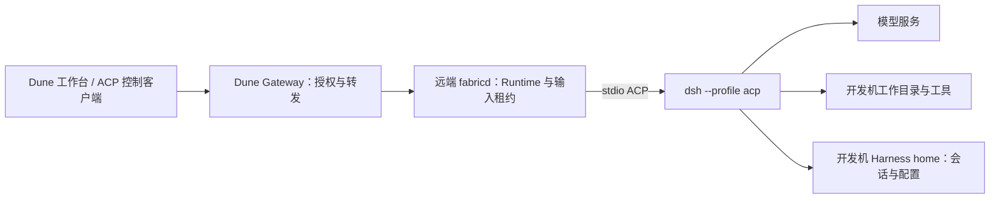
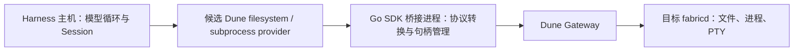

# Dune 参考项目调研：DeepSeek Harness

> 关联：[调研索引](README.md) · [个人 Web 方案](../personal-web-plan.md) · [企业扩展方案](../enterprise-extensibility-plan.md) · [实现说明](../implementation.md)

## 1. 结论

**DeepSeek Harness（下文简称 dsh）最适合作为 Dune 托管的 Agent，以及 Dune 上层产品的架构参考。近期建议先做 ACP 互操作验证，不建议把 Dune 改造成另一套 Harness，也不建议立即照搬其动态插件体系。**

两者的主要分工是：dsh 决定模型如何思考、调用工具、组织上下文和恢复会话；Dune 提供到指定执行环境的授权连接、进程与终端管理、文件/Git/端口能力。Dune 已有个人工作台和身份、存储模块，不能简单理解为“只有隧道”；但这些产品模块也不等于一个模型执行循环。

本次最影响落地的发现有四项：

1. **ACP 有实际接入基础，但恢复协议不匹配。** dsh 声明 `session/list`、`session/resume`、`session/close`，明确不支持 `session/load` 和历史消息回放；Dune 托管 ACP 当前识别 `loadSession` 并调用 `session/load`。基础新会话值得验证，完整历史恢复不能声称已经兼容。[H3](#evidence-h3)[H4](#evidence-h4)[D2](#evidence-d2)
2. **远程执行 provider 是中期方向，不是薄薄一层 API 转发。** dsh 已有 E2B provider POC，证明“模型与会话留在 Harness，文件与命令一起远程化”的组合方式。但其 subprocess、filesystem 契约比 Dune 当前 Exec/Files API 更丰富，需要明确差距和降级边界。[H7](#evidence-h7)[H8](#evidence-h8)[H9](#evidence-h9)[D3](#evidence-d3)[D4](#evidence-d4)
3. **最值得借鉴的是职责划分和生命周期契约。** 能力定义、实现与消费者分开，依赖消失时清理消费者，取消后等待受管工作结束，再结算结果。这些原则可以用 Dune 现有 Go 包、构造函数和 `Close`/context 实现，不必引入 Cordis。[H1](#evidence-h1)[H2](#evidence-h2)[H4](#evidence-h4)[D5](#evidence-d5)
4. **日志、审批和重试要按各自层次处理。** Harness 的持久会话日志不能成为 Gateway 的传输 journal；工具审批不能替代 Dune 的目标授权；连接断开不能被映射为工具成功，也不能触发 prompt 或写操作的自动重放。[H5](#evidence-h5)[H6](#evidence-h6)[D1](#evidence-d1)[D6](#evidence-d6)

## 2. 调研基线与证据边界

| 项目 | 基线 |
| --- | --- |
| 调研日期 | 2026-09-08 |
| 来源仓库 | [deepseek-ai/deepseek-harness](https://github.com/deepseek-ai/deepseek-harness) |
| 固定源码 | [`c389f96bf3a9b6807cb71ed6bdad5849be0df6d8`](https://github.com/deepseek-ai/deepseek-harness/tree/c389f96bf3a9b6807cb71ed6bdad5849be0df6d8) |
| 源码提交时间 | 2026-09-08 00:46:19 +08:00 |
| 版本标记 | 根 `package.json` 为 `0.1.3-alpha.2`；这是源码标记，不代表本报告验证了对应 npm 发布物 |
| 运行依赖 | 根清单要求 Node.js `^22.19.0 \|\| >=24.0.0`、pnpm `11.7.0`；不应把源码构建依赖全部当作终端用户运行依赖 |
| 许可证 | 根 LICENSE 为 MIT；第三方依赖另有 THIRD_PARTY_NOTICES，不能把整个依赖闭包概括为 MIT [H0](#evidence-h0) |
| 上游状态 | README 标注 developer preview、可能有破坏性变化；SAFETY 标注未经安全审计 [H0](#evidence-h0) |
| Dune 基线 | 本地 HEAD `3675df2bd1bf46486369e87b737d9c74745a875c`，结合调研时工作区；工作区有既有未提交修改，不将其等同于已发布版本 |
| 方法 | 阅读固定版本文档、关键实现及测试源码，对照 Dune 当前代码；没有安装或执行 dsh，没有真实模型调用、端到端互操作、性能或安全测试 |

下文“来源事实”由固定版本支撑；“建议”“可行性”是基于接口的判断。“源码有测试”只代表发现了测试材料，不代表本次运行通过。Dune 方案文档中的目标能力，以当前代码核对后才记为现状。

## 3. 来源事实：dsh 的架构与能力

### 3.1 插件树是应用的组装单位

dsh 使用 TypeScript/Node.js 与 Cordis。模型适配器、Agent 接口及默认循环、工具注册、会话日志等均由插件提供。应用先选择命名 profile，再按顺序叠加 bundle 和 patch，构成启动时的插件树。[H1](#evidence-h1)

几个容易混淆的对象需要分开：

| dsh 对象 | 来源含义 | 与 Dune 的关系 |
| --- | --- | --- |
| Profile | Harness home 中的应用组合，选择 bundles、外部插件和 patch | 不等于 Dune 启动命令 payload |
| Bundle | 可分发的配置行与实现包组合 | 可参考发行版装配思路，不是 Dune 环境模板 |
| Session | 有持久事件历史的 Agent 会话 | 不等于 Dune Runtime，也不等于 Runner |
| Agent | 操作会话的活动执行对象；默认 loop 是其实现 | 可运行在 Dune 托管进程内，不由 Gateway 驱动模型 |
| Workspace | dsh 的工作空间对象和执行目录上下文 | 不替代 Dune 的目标、绑定或访问控制 |

内置入口包括 `web`、`headless`、`sdk`、`sdk-minimal` 和 `acp`。`headless` 是一次任务执行后退出，不是持续交互的终端聊天应用。`web` 使用 live patch reload；`headless`、`sdk`、`sdk-minimal`、`acp` 在启动时一次性应用组合，避免执行中更换依赖破坏 stdio 或任务生命周期。[H1](#evidence-h1)[H10](#evidence-h10)

Cordis 将服务、事件监听等注册视为可撤销 effect；外部定时器、连接等需要显式登记清理函数。必需服务不可用时，依赖它的插件会退出；服务恢复后再激活。异步 disposer 可能并发执行，必须有顺序的清理应放在同一个 disposer 内显式等待。**这提供的是进程内资源所有权机制，不是进程隔离或权限边界。**[H2](#evidence-h2)

### 3.2 模型循环、持久事实和实时事件分离

一次 step 包含模型请求及其工具调用；一次 turn 可以含多个 step。循环从 inbox 接收输入，组装模型上下文与工具 schema，消费模型响应，执行工具，并决定是否继续。[H1](#evidence-h1)

dsh 区分三类事件：

- Session 事件是持久事实，用于投影模型历史及恢复会话。
- Agent 事件面向活动中的执行对象，例如请求拦截、状态和输入处理。
- 能力事件用于工具、文件、策略等扩展点。[H1](#evidence-h1)

已结算的 assistant message 保存紧凑流；失败、重试或取消的 attempt 可以留在日志而不进入后续模型历史。实时 chunk 不逐条等同于持久记录，进程在结算前硬退出可能丢失尚未落定的流。持久化 seam 与 JSONL provider 分离，后者处理文件格式、generation、压缩和迁移。**可从日志重建模型上下文，不表示能重做每个外部副作用，也不表示能完整恢复硬退出前所有实时内容。**[H1](#evidence-h1)[H5](#evidence-h5)

### 3.3 工具执行有策略管线，但不是 Dune 授权协议

工具执行经过 pre-execute、monotonic guards、execute、post-execute、最终内容处理和结果通知。扩展可以改写执行前后的决策；monotonic guard 只能拒绝或不表态，不能覆盖另一项拒绝。调用身份受到保护，最终结果有固定的物化和通知步骤。取消到达时，尚未启动的工具与已经启动、需要排空的工具有不同处理。[H6](#evidence-h6)

这对 Dune 的启发是让“谁检查、检查哪次请求、何时执行、何时报告完成”清晰可验，而不是把可变的工具 middleware 当成可信授权机制。dsh 内部一次 tool call 可能访问本地文件、MCP 或远端执行服务；Dune 只能对实际经过其入口的操作执行自己的检查。

### 3.4 远程化围绕同一个执行环境

dsh 把可替换能力划分为定义、provider、consumer 三种角色。E2B 家族由共享 sandbox、filesystem provider 和 subprocess provider 组成，让文件、Shell、PTY 使用同一个远程环境，Harness 进程、模型请求和会话状态仍在原处。该家族在基线中明确为 POC，默认组合不启用。[H7](#evidence-h7)

这条思路与 Dune 有较强互补性，但接口不是天然一致的：

- subprocess 提供按流配置的 stdin/stdout/stderr、原始 pipe、有限输出收集、输出字节游标、可选完整输出文件、退出事实和受管进程范围的终止/等待接口。[H8](#evidence-h8)
- filesystem 使用不透明目标身份和版本 token，支持观察后的条件写入及结构化错误；消费者不能假设目标 key 就是本机路径。[H9](#evidence-h9)
- E2B POC 自述仍有全量 SDK 输出占用宿主内存、数字 PID/PGID 无重用 fencing、同 UID 控制文件暴露、临时环境丢失等限制；不能把 POC 的存在当成成熟远程执行保证。[H7](#evidence-h7)

### 3.5 ACP 与专用 SDK 是两套控制面

**ACP** 面向可信程序控制器，使用 stdio JSON-RPC。它提供新建、列举、恢复、关闭、prompt/cancel、配置选项及语义更新。一条连接能拥有多个 Session，每个 Session 同时只允许一个 prompt。审批通过一次性 allow/reject 选项完成；`authenticate` 直接成功，没有内建远程用户鉴权。[H3](#evidence-h3)[H4](#evidence-h4)

ACP 的关闭顺序包含停止接纳、取消、排空更新、处理后代、flush 持久化和释放 scope；关闭一个 Session 不等于删除历史，也不等于退出全部会话。它不暴露 dsh 专用 UI 卡片、计划、终端面板或历史 transcript replay。[H3](#evidence-h3)[H4](#evidence-h4)

**TypeScript/Python SDK** 则通过专用 stdio JSON-RPC 控制运行时，由客户端启动和管理 `dsh --profile sdk`。高层 `run()` 依据输入被消费的凭据到整个 Agent idle 的区间收集结果，`finalResponse` 是区间内最后的主会话 assistant 文本，不保证是一条 prompt 的独占因果结果。基线 SDK 还没有中途 prompt-cancel，放弃执行需要关闭运行时；这与 ACP 的 cancel 能力不同。[H11](#evidence-h11)

因此，“均使用 JSON-RPC”不能推出“SDK 与 ACP 方法兼容”，也不能把 dsh SDK 当作已能远程连接 Dune 的客户端。

## 4. 对照 Dune 当前实现

| 维度 | dsh 基线 | Dune 当前实现与边界 |
| --- | --- | --- |
| 模型执行 | 自带模型适配、Agent loop、工具和上下文管理 | 托管外部 Agent 进程；模型策略不在 DTP 内 [D1](#evidence-d1)[D3](#evidence-d3) |
| 对外连接 | ACP/SDK stdio；另有 Web 应用 | CLI/SDK 经 Gateway 到 fabricd；默认 WS + Yamux + protobuf [D1](#evidence-d1) |
| 应用扩展 | Cordis 动态服务与插件树 | Go 宿主显式装配，`pkg/host.Options` 注入身份、访问检查、存储和拨号等 [D5](#evidence-d5) |
| 目标与权限 | ACP 信任控制器；工具层有自己的审批 | 产品身份和访问检查 + 目标/Runtime 身份校验 + 持续输入租约 [D2](#evidence-d2)[D6](#evidence-d6) |
| 会话历史 | Agent 事件持久化，原生恢复 | 托管 ACP 不存完整 transcript；历史依赖 Agent 能力 [D2](#evidence-d2) |
| PTY | subprocess/terminal provider 所有权模型 | tmux 独立于 fabricd；重开 engine 可恢复存活 PTY，stop 销毁对应会话 [D7](#evidence-d7) |
| 文件 | opaque target/version、条件写入等 | 分块读、原子写/上传、目录与结构化 Git；当前 Files 没有版本条件字段 [D4](#evidence-d4) |
| 执行结果 | 工具/turn/Session 多层结算 | ExecResult、Runtime 和流事件；`written` 只是输入写入确认 [D1](#evidence-d1)[D3](#evidence-d3) |
| 数据存储 | Harness 内容与事件存储 | 宿主 SQLite/PostgreSQL 元数据；开发机还有 AgentConfig、tmux 状态，不能笼统描述为“全仓库无持久化” [D5](#evidence-d5)[D7](#evidence-d7)[D8](#evidence-d8) |

这里有两个文档与实现范围差异值得保留：底层设计中的 Profile 含 `environment|agent`，但当前 `api.Profile.Validate()` 只接收 `version=1`、`kind=agent`、`adapter=pty|acp`；不能用目标设计生成已经支持的 environment 接入示例。当前 fabricd 还在开发机保存 `agents.json`，与底层调研中“命名配置由上层负责”的目标分工应分开理解。本报告不据此重构现有实现。[D4](#evidence-d4)[D8](#evidence-d8)

## 5. 组合路径与兼容性判断

### 5.1 近期优先：Dune 托管远端 dsh ACP 进程



这条路径让 Agent 与文件位于同一开发机，Dune 复用现有 Runtime、网络和用户入口。模型凭据、dsh 配置与会话文件留在运行 dsh 的环境；Dune 的目标访问凭据与模型凭据各自管理。

以下是**待验证的 Profile 形状**，不是已交付样例。假设 `dsh` 已安装到远端 fabricd 可见的 PATH，目录已存在，模型凭据和 profile 已准备好。为可复现部署，应固定 dsh 版本和 patch，避免每次启动在线拉取 latest。

```yaml
version: 1
kind: agent
working_directory: /absolute/workspace
adapter: acp
managed_acp: true
start:
  argv: [dsh, --profile, acp]
```

`managed_acp: true` 由 Dune 控制协议握手及会话；走原始 ACP 控制客户端时，应移除此字段或设为 `false`，由调用方唯一拥有 JSON-RPC 控制逻辑。两者不可同时往一个进程注入握手和审批响应。[D2](#evidence-d2)[D3](#evidence-d3)

| ACP 场景 | dsh | Dune 托管 ACP | 判断及后续工作 |
| --- | --- | --- | --- |
| 初始化、新建、文本 prompt、cancel | 支持 | 已有对应方法 | 基础交集明确，仍需真实互操作 |
| 权限请求 | 一次性允许/拒绝 | 有待审批 ID 与选项校验 | 验证展示、重复应答、过期及取消竞态 |
| 列举持久会话 | `session/list` | 检查 list capability 后调用 | 可以列举不代表可以恢复 |
| 恢复执行 | `session/resume`，不回放旧更新 | 仅按 `loadSession` 支持 `session/load` | **当前缺口**；需新增 resume 能力与操作，不能把 load 偷换成 resume |
| 历史展示 | ACP 不提供 transcript replay | load 路径可消费 Agent 回放 | resume 后必须提示历史未同步；完整历史需另议上层数据源 |
| 关闭某一 Session | `session/close`，保留持久记录 | 无对应 action；Runtime stop 是进程级 | 首期限定一 Runtime 对应一个活动 Session；禁止混同 close 与 stop |
| 多 Session、模型选项、图片/MCP 参数 | dsh 有相应能力或条件支持 | 当前托管 action 是单 Session、文本输入，new/load 传空 MCP 列表 | 首期明确范围；后续按能力协商扩展，不能自动承诺全功能 |
| 结果增量 | ACP 发布已提交语义内容，不发原始 provider delta | 接收 `session/update` | UI 的增量粒度取决于来源，不能承诺 token 级流式体验 |

以上判断来自 dsh 方法注册/能力响应和 Dune controller，而非仅看双方 README。[H3](#evidence-h3)[H4](#evidence-h4)[D2](#evidence-d2)

原始 ACP 是更低耦合的验证入口：Dune 检查 JSON-RPC envelope 并转发，调用方可自行协商 resume/close 等方法。但原始通道的审批、会话隔离、请求关联和能力选择都归调用方；它不会自动补齐 Dune 工作台功能。[D3](#evidence-d3)

**生命周期必须分别定义：** 浏览器断开、Dune 输入流断开、fabricd 重启、dsh stdio EOF、ACP Session close 和 Runtime stop 是不同事件。Dune 的 tmux 保活承诺不适用于托管 ACP；dsh 能恢复已保存 Session，也不代表旧进程或未完成 prompt 可无缝继续。重启后应显式选择 Session、重新检查能力和目标，再提交新操作。[H4](#evidence-h4)[D2](#evidence-d2)[D7](#evidence-d7)

### 5.2 轻量试用：headless 经 Exec 或 PTY

一次性任务可以尝试 `dsh --profile headless "任务内容"`，由 Dune Exec 或 PTY 启动。它适合验证环境、命令路径和退出状态，不等同于接入一个交互式 TUI。[H10](#evidence-h10)

当前 Dune Exec 默认 300 秒、stdout/stderr 各保留至 128 KiB，并返回截断标记；长 Agent 任务需要显式选择时限和输出方案。PTY 适合人工观察长任务，但屏幕与 tmux 历史不是结构化 Agent 事件，不能据此恢复 turn 或审批。任务成功仍需检查 Agent 输出及产物，不能只看网络 EOF。[D3](#evidence-d3)

若运行 dsh 自带 Web，则还涉及 Web 入口、会话和端口暴露的产品整合；Dune 的 loopback 端口转发只是连接能力，不能直接等同于已接入 Dune 登录与工作台。本报告不把该路径作为首期默认方案。

### 5.3 中期探索：dsh 使用 Dune 作为远程执行 provider



这是**尚未实现的提案**。dsh 的 TypeScript provider 可通过一个范围有限的 Go 桥接进程复用 Dune SDK；也可另做 TypeScript 协议客户端，但要承担完整握手、租约、帧、背压和错误映射的维护。建议先用桥接方式验证价值，所有执行仍走 SDK → Gateway → fabricd，不直接连开发机文件系统绕过授权。

| provider 需要的语义 | 当前 Dune 差距 | 可行处理 |
| --- | --- | --- |
| 文件与命令在同一环境 | Files 本身不携带 dsh Workspace 对象 | provider 持有固定绑定与 cwd，拒绝中途偷偷切换目标 |
| 原始持续 stdin/stdout/stderr | Exec 是有界批量结果；ACP 入口校验 JSON-RPC；PTY 有终端语义 | 不能用 ACP 或 PTY 冒充任意 pipe；先限定 batch Shell，完整支持前另定进程流 API |
| 输出游标、尾部收集、完整 spill | Exec 保留输出前缀，没有对应游标/spill 契约 | 明确报截断；若需 spill，规定落盘位置、容量与清理，禁止虚构可恢复输出 |
| `terminate` 与受管范围 `waitForExit` | 内部有进程组 guardian，但公开接口不等价于该完整契约 | 不只映射为 cancel HTTP 请求；另定义停止、观察和未知状态 |
| 文件版本条件写入 | Files/Upload 没有预期版本字段 | 仅串行化桥接请求仍挡不住外部编辑；完整 guarded-write 需要执行侧比较与写入语义 |
| 环境 tombstone、清理继承变量 | Dune Profile Env 是字符串映射并合并进程环境 | 不能直接声称符合 dsh 环境语义；用审计过的启动包装或显式 API 设计 |
| 身份失效及结果未知 | Dune 返回目标失效/`RESULT_UNKNOWN`，不自动重放 | provider 保留“可能已经执行”的事实，不转换成成功、未执行或透明重试 |

来源接口与 Dune 对照见 [H8](#evidence-h8)[H9](#evidence-h9)[D1](#evidence-d1)[D3](#evidence-d3)[D4](#evidence-d4)。E2B POC 的“sandbox 已不存在即认为受管范围消失”也不能套用在 Dune 断线上：开发机离线时其进程、tmux 和文件可能仍然存在。[H7](#evidence-h7)[D7](#evidence-d7)

身份入口同样需要限定。人类在 Dune 已授权的目标中启动任务，与给中央无人值守 Harness 发长期机器身份，是两个产品范围。当前企业方案首版不承诺通用机器人调用入口；provider 原型应在既有授权范围内做，不把 fabricd 的机器凭据当成人类执行凭据。[D9](#evidence-d9)

## 6. 对 Dune 可复用、上层参考与不纳入核心

### 对底层和模块工程可复用

1. **按消费者定义小接口。** 参考 filesystem/subprocess 的职责划分，先写清契约和失败语义，再增加 provider；沿用 Dune 的 Go 显式装配，不为了“可扩展”先建设统一插件总线。
2. **资源所有权可等待。** 连接、订阅、Runtime、子进程及关闭任务都应有明确 owner；取消请求不等于清理结束，先停止接纳再排空。复用现有 `App.Close`/`Done` 和 process guardian，按缺口补强。[D5](#evidence-d5)[D10](#evidence-d10)
3. **能力声明如实反映实现。** resume 与 load、原始 pipe 与 PTY、批量结果与可恢复输出必须分别声明；不支持即明确失败，不用静默降级制造成功假象。
4. **策略拒绝不可被旁路允许覆盖。** 借鉴 monotonic guard 的原则，保留 Dune 已有“外部 allow 不能替代目标/Runtime 校验、检查失败不回退 owner 放行”的行为。[H6](#evidence-h6)[D6](#evidence-d6)
5. **协议适配验证行为而非名称。** 输入受理、写入、Agent 完成、进程退出、历史恢复分别校验；测试不要只断言 socket 建立或拿到一条 final 文本。

### 只在上层产品按需参考

- Session 事件投影、工具过程展示、恢复后历史缺口提示和任务状态呈现。
- Agent preset、模型选择、技能发现、插件配置与发行组合；配置与凭据应分离。
- 子 Agent 的一次性任务与可继续会话、父子关系、消息与取消语义。dsh 的 subagent seam 提供了这类抽象，但这些对象不应加入 Dune 底层 Runtime 的业务状态机。[H12](#evidence-h12)
- 使用固定模型响应 replay、会话快照及不变量检查来降低适配回归成本；另保留真实 Agent 验收。上游有对应测试工具及 ACP 组合测试，可用作测试设计参考。[H13](#evidence-h13)

### 不纳入 Dune 协议核心

不引入模型调用/计费与 token 预算、system prompt 拼装、context compaction、会话内容库、Agent 任务板、动态插件市场或任意代码热加载。不把 dsh 的 JSON-RPC 方法搬进 DTP 作为模型专用协议，也不让 Gateway 保存 prompt、工具正文和完整会话日志。

这不禁止 Dune 上层产品以后选择这些功能；含义是必须单独确定 owner、数据位置、API 和验收，不能由一次 Agent 接入隐式扩张。dsh 的 sandbox/审批也不能成为 Dune 的强隔离承诺；Dune 的 cwd 和入口访问检查同样不是 OS 沙箱。[H0](#evidence-h0)[D6](#evidence-d6)

## 7. 建议推进顺序与验收条件

以下是后续实施建议，本次只交付调研文档。

| 阶段 | 具体产出 | 通过条件 |
| --- | --- | --- |
| P0：固定版本互操作 | 安装说明、原始 ACP 样例、托管 ACP 能力矩阵 | 同一固定 dsh 版本完成 initialize/new/text prompt/list/permission/cancel；记录实际更新类型、错误和退出行为 |
| P1：托管恢复与体验 | 明确区分 resume/load；恢复入口、能力提示和回归测试 | 无 load 时不发送 load；resume 后不伪装历史完整；旧审批不复活；原始 ACP 行为不被破坏 |
| P2：执行 provider 原型 | 接口差距说明、限定能力的 Go 桥接与 dsh 插件 | 同一远端目录完成读写和明确受支持的命令；未知结果、目标变更、断线、取消、截断都保持真实语义 |
| P3：有真实需求再扩展 | 通用进程流、条件写入或上层会话产品方案 | 有实际消费者和验证用例；涉及协议保证时同步规范、协议与互操作测试 |

P0/P1 应至少覆盖以下故障场景：

| 场景 | 必须观察到的结果 |
| --- | --- |
| prompt 已提交后客户端断开 | 不自动再次提交；当前任务状态与客户端连接状态分开 |
| 浏览器重连时 Agent 正在等待审批 | 只呈现当前有效审批；重复或过期应答拒绝 |
| dsh 在 prompt/恢复中退出 | 报告失败或结果未知；旧 Session ID 不成为新 Runtime 的自动授权 |
| fabricd 重启 | PTY 与 ACP 的不同生命周期符合 Dune 契约；不承诺 ACP 进程保活 |
| 有 list、无 load、有 resume | 能力显示准确；列举成功不触发错误的 load 调用 |
| cancel 与输出/审批同时到达 | 等待 Agent 结算；不把 cancel 已发送当成工具副作用已停止 |
| 目标绑定变化、输入 owner 变化或授权到期 | 旧访问被拒绝，适配器不改用另一目标继续写 |
| 大输出与慢客户端 | 内存/缓冲有界、截断或断流可辨，不以丢失数据伪造完整结果 |

性能暂不作数值判断。原型阶段再测：冷启动至 ACP ready、prompt 到首个语义更新、取消至结算、重连可见状态的延迟，以及大输出内存上界；记录系统、dsh 版本、模型和网络条件，避免把模型延迟误算成 Dune 开销。

## 8. 证据索引

上游链接全部固定到本次源码提交；Dune 相对链接指向本仓库，未来修改时需按本节基线重新核对。

### 上游源码与文档

- <a id="evidence-h0"></a>**[H0] 基线与声明：** [package.json](https://github.com/deepseek-ai/deepseek-harness/blob/c389f96bf3a9b6807cb71ed6bdad5849be0df6d8/package.json)、[README](https://github.com/deepseek-ai/deepseek-harness/blob/c389f96bf3a9b6807cb71ed6bdad5849be0df6d8/README.md)、[LICENSE](https://github.com/deepseek-ai/deepseek-harness/blob/c389f96bf3a9b6807cb71ed6bdad5849be0df6d8/LICENSE)、[THIRD_PARTY_NOTICES](https://github.com/deepseek-ai/deepseek-harness/blob/c389f96bf3a9b6807cb71ed6bdad5849be0df6d8/THIRD_PARTY_NOTICES.md)、[SAFETY](https://github.com/deepseek-ai/deepseek-harness/blob/c389f96bf3a9b6807cb71ed6bdad5849be0df6d8/SAFETY.md)。
- <a id="evidence-h1"></a>**[H1] 总体架构与事件：** [architecture.md](https://github.com/deepseek-ai/deepseek-harness/blob/c389f96bf3a9b6807cb71ed6bdad5849be0df6d8/docs/architecture.md)、[Agent loop 实现](https://github.com/deepseek-ai/deepseek-harness/blob/c389f96bf3a9b6807cb71ed6bdad5849be0df6d8/packages/core/agent-loop/src/agent.ts)。
- <a id="evidence-h2"></a>**[H2] 插件生命周期：** [lifecycle-and-effects](https://github.com/deepseek-ai/deepseek-harness/blob/c389f96bf3a9b6807cb71ed6bdad5849be0df6d8/docs/cordis-tutorial/02-lifecycle-and-effects.md)、[services/inject](https://github.com/deepseek-ai/deepseek-harness/blob/c389f96bf3a9b6807cb71ed6bdad5849be0df6d8/docs/cordis-tutorial/03-services.md)。
- <a id="evidence-h3"></a>**[H3] ACP 对外契约：** [ACP README](https://github.com/deepseek-ai/deepseek-harness/blob/c389f96bf3a9b6807cb71ed6bdad5849be0df6d8/packages/acp/acp/README.md)、[ACP profile patch](https://github.com/deepseek-ai/deepseek-harness/blob/c389f96bf3a9b6807cb71ed6bdad5849be0df6d8/packages/bundle/acp-app/cordis.patch.yml)。
- <a id="evidence-h4"></a>**[H4] ACP 实现：** [审批与能力响应](https://github.com/deepseek-ai/deepseek-harness/blob/c389f96bf3a9b6807cb71ed6bdad5849be0df6d8/packages/acp/acp/src/index.ts#L152-L194)、[方法注册与关闭](https://github.com/deepseek-ai/deepseek-harness/blob/c389f96bf3a9b6807cb71ed6bdad5849be0df6d8/packages/acp/acp/src/index.ts#L372-L415)、[Session 清理](https://github.com/deepseek-ai/deepseek-harness/blob/c389f96bf3a9b6807cb71ed6bdad5849be0df6d8/packages/acp/acp/src/session.ts#L427-L470)。
- <a id="evidence-h5"></a>**[H5] 持久化：** [SessionPersistence 契约](https://github.com/deepseek-ai/deepseek-harness/blob/c389f96bf3a9b6807cb71ed6bdad5849be0df6d8/packages/session/session-persistence/src/index.ts)、[JSONL provider](https://github.com/deepseek-ai/deepseek-harness/blob/c389f96bf3a9b6807cb71ed6bdad5849be0df6d8/packages/session/session-persistence-jsonl/README.md)。
- <a id="evidence-h6"></a>**[H6] 工具策略与结果：** [管线图](https://github.com/deepseek-ai/deepseek-harness/blob/c389f96bf3a9b6807cb71ed6bdad5849be0df6d8/docs/tool-execution-pipeline.md)、[guard 注册](https://github.com/deepseek-ai/deepseek-harness/blob/c389f96bf3a9b6807cb71ed6bdad5849be0df6d8/packages/core/tools/src/index.ts#L1090-L1116)、[执行与取消契约](https://github.com/deepseek-ai/deepseek-harness/blob/c389f96bf3a9b6807cb71ed6bdad5849be0df6d8/packages/core/tools/src/index.ts#L1318-L1350)。
- <a id="evidence-h7"></a>**[H7] E2B POC：** [家族说明](https://github.com/deepseek-ai/deepseek-harness/blob/c389f96bf3a9b6807cb71ed6bdad5849be0df6d8/packages/e2b/README.md)、[subprocess provider 及已知限制](https://github.com/deepseek-ai/deepseek-harness/blob/c389f96bf3a9b6807cb71ed6bdad5849be0df6d8/packages/e2b/subprocess-e2b/README.md)。
- <a id="evidence-h8"></a>**[H8] 进程契约：** [subprocess types](https://github.com/deepseek-ai/deepseek-harness/blob/c389f96bf3a9b6807cb71ed6bdad5849be0df6d8/packages/subprocess/subprocess/src/types.ts)。
- <a id="evidence-h9"></a>**[H9] 文件契约：** [filesystem types](https://github.com/deepseek-ai/deepseek-harness/blob/c389f96bf3a9b6807cb71ed6bdad5849be0df6d8/packages/fs/fs/src/types.ts)、[filesystem Service Definition](https://github.com/deepseek-ai/deepseek-harness/blob/c389f96bf3a9b6807cb71ed6bdad5849be0df6d8/packages/fs/fs/src/index.ts)。
- <a id="evidence-h10"></a>**[H10] 单次任务入口：** [headless bundle](https://github.com/deepseek-ai/deepseek-harness/blob/c389f96bf3a9b6807cb71ed6bdad5849be0df6d8/packages/bundle/headless/README.md)。
- <a id="evidence-h11"></a>**[H11] 专用 SDK：** [SDK 包组](https://github.com/deepseek-ai/deepseek-harness/blob/c389f96bf3a9b6807cb71ed6bdad5849be0df6d8/packages/sdk/README.md)、[TypeScript client 契约与限制](https://github.com/deepseek-ai/deepseek-harness/blob/c389f96bf3a9b6807cb71ed6bdad5849be0df6d8/packages/sdk/client/README.md)。
- <a id="evidence-h12"></a>**[H12] 子 Agent：** [subagent Service Definition](https://github.com/deepseek-ai/deepseek-harness/blob/c389f96bf3a9b6807cb71ed6bdad5849be0df6d8/packages/subagent/subagent/README.md)。
- <a id="evidence-h13"></a>**[H13] 可参考的验证材料：** [ACP control-surface e2e](https://github.com/deepseek-ai/deepseek-harness/blob/c389f96bf3a9b6807cb71ed6bdad5849be0df6d8/apps/cli/tests/profiles/acp/tests/control-surface.e2e.ts)、[LLM replay](https://github.com/deepseek-ai/deepseek-harness/blob/c389f96bf3a9b6807cb71ed6bdad5849be0df6d8/packages/test-support/llm-replay/README.md)、[Session snapshot](https://github.com/deepseek-ai/deepseek-harness/blob/c389f96bf3a9b6807cb71ed6bdad5849be0df6d8/packages/test-support/session-snapshot/README.md)。

### Dune 代码与边界

- <a id="evidence-d1"></a>**[D1] 调用链与未知结果：** [README](../../README.md)、[协议客户端](../../pkg/client/client.go)、[SDK](../../pkg/sdk/client.go)。
- <a id="evidence-d2"></a>**[D2] 托管 ACP：** [能力识别、会话操作和审批](../../pkg/fabricd/acp.go)、[ACP 测试](../../pkg/fabricd/acp_test.go)。
- <a id="evidence-d3"></a>**[D3] Runtime/原始 ACP/Exec：** [runtime.go](../../pkg/fabricd/runtime.go)。
- <a id="evidence-d4"></a>**[D4] Profile 与 Files：** [API types](../../pkg/api/types.go)、[文件与上传实现](../../pkg/fabricd/files.go)。
- <a id="evidence-d5"></a>**[D5] 产品装配与关闭：** [host.App](../../pkg/host/app.go)、[存储配置](../../pkg/storage)。
- <a id="evidence-d6"></a>**[D6] 访问约束：** [policy.go](../../pkg/access/policy.go)、[持续输入租约](../../pkg/fabricd/input_lease.go)、[访问检查说明](../access-checks.md)。
- <a id="evidence-d7"></a>**[D7] PTY 恢复与进程边界：** [fabricd.Open](../../pkg/fabricd/open.go)、[Runtime 生命周期](../../pkg/fabricd/runtime.go)、[tmux 实现](../../pkg/fabricd/tmux.go)。
- <a id="evidence-d8"></a>**[D8] 开发机配置持久化：** [profiles.go](../../pkg/fabricd/profiles.go)、[个人 Web 方案](../personal-web-plan.md)。
- <a id="evidence-d9"></a>**[D9] 目标分层及无人值守范围：** [企业扩展方案](../enterprise-extensibility-plan.md)。这是设计边界，实施状态仍以代码为准。
- <a id="evidence-d10"></a>**[D10] 进程所有权：** [process guardian](../../internal/process/process.go)、[cleanup](../../internal/process/cleanup.go)。
