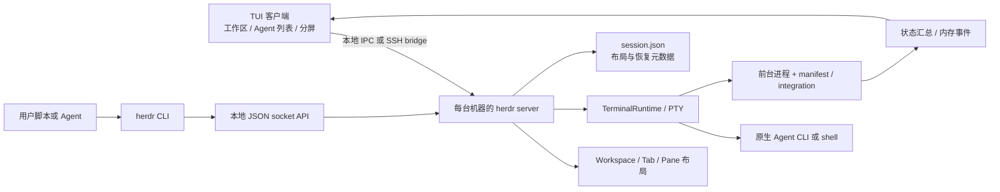

# herdr 调研：工作区、并行 Agent 与通信机制

> 调研日期：2026-09-17。面向 Dune 个人工作台与 SandDance 企业工作台。本文是源码调研与产品建议，不代表方案已经实现。
>
> herdr 固定提交：`e7e3dfa60e359404def46503dd105c165d02a561`，该提交的 Cargo 包版本为 `0.9.1`；不将包版本等同于已发布稳定版。Dune 基线：`e3e18b0a8b32aa5d895b545e6322e50abc9eb530`；SandDance 基线：`e5a7db8148aa7d8a3b6aed1db1a44c81b90e8da6`。两份本地代码在开始调研时均无未提交改动。
>
> 方法：核对固定提交的源码、同提交 `docs/next` 文档及仓库截图，并对照两个本地项目的实现。未安装或运行 herdr，未执行真实 Agent、SSH、故障恢复或性能实测。文中的耗时和交互目标若未另有说明，均为建议验收目标。

> **设计范围已确认：** 详细方案见 [Dune / SandDance 工作台与 Tenant Agent 通信](herdr-adoption-design.md)。本文的产品建议已同步为 PTY / ACP 双核心入口、Tenant 自由分屏与 MCP 协作、个人布局和已读存入数据库；ACP pending 只保存在内存，当前目录与 worktree 由用户选择。

## 结论与优先级

herdr 最值得借鉴的是：**让人围绕项目组织工作，随时看见哪些 Agent 正在做事、哪些需要回应，并能直接进入相应的工作现场。** 后台进程托管、状态识别、分屏和可编程控制共同支撑了这个体验。[H01] [H06]

对 Dune、SandDance，建议优先做四件事：

1. **先做全局 Agent 列表和并行工作台。** PTY / ACP 同为核心入口；Tenant 内任意 Agent 可以跨项目、跨 Runner 分屏，单独显示“工作中、需要回应、结果未读”。
2. **把项目与继续工作入口接起来。** 记住目录、常用 Agent 和工作现场，减少每次选择 Runner、Profile、cwd 的操作；启动时可选择当前目录或 worktree。
3. **通过自动注入 MCP 完成 Tenant 协作。** 提供发现、启动、投递、等待、读取等原语，支持主 Agent 在已有且就绪的 Runner 上创建助手和协调结果。
4. **明确数据库与运行状态的边界。** 项目、个人布局、已读和原生会话恢复索引保存到应用数据库；每个 Runtime 的队列、操作记录与有界输出保存在 fabricd 内存。宿主 Pod 重启不清空队列，fabricd 实例失效后不恢复旧队列。

第一批产品价值无需等待完整任务编排系统。另一方面，herdr 的终端投递和状态等待也不能直接承担企业级任务完成保证：**`done` 表示尚未看过的空闲状态；`agent prompt --wait` 等待生命周期变化，不关联某一条 prompt 的唯一完成结果。** 这两点决定了哪些交互可以借鉴、哪些协议需要我们自己补齐。[H14] [H16]

## 1. herdr 的产品形态与“打开就能用”

herdr 是运行在现有终端里的 Rust TUI，不是 Electron 桌面应用，也不是自带模型循环的 Agent 框架。它用 `ratatui` 等组件组织界面，以 PTY 托管原生 Agent CLI，使用 libghostty-vt 处理终端语义；用户仍使用已安装、已登录的 Agent。[H01] [H22] [H28]

| 使用过程 | herdr 的实现或行为 | 值得借鉴的原因 |
| --- | --- | --- |
| 在项目目录运行 `herdr` | 检查既有后台 server；不存在时启动，等待就绪后连接 | 用户不必先理解 server、socket 或配置文件 |
| 第一次进入空 session | 根据启动 cwd 建立首个 Workspace、Tab、Pane | 第一个可操作现场自动出现 |
| 在终端直接启动 Agent | 识别前台进程和状态；可选 integration 提高特定 Agent 的能力 | 可以先工作，再完善集成 |
| 同时运行多个 Agent | 项目列表与独立 Agent 列表；可点击跳转、分屏、拖动边界 | 人无需逐个打开终端确认是否卡住 |
| 切换项目或机器 | 保留各自工作现场，非当前机器继续更新摘要 | 导航不承担“结束当前工作”的含义 |
| 关闭客户端再打开 | 重连同一个存活的后台 server | 浏览界面的生命周期与执行分开 |

来源：[启动流程][H02]、[空工作区初始化][H03]、[快速开始][H23]、[多机器行为][H12]。

这里的“开机即用”应落实为**打开入口就能继续工作**。源码证据支持一条命令启动/重连，并不意味着默认安装了 OS 登录启动服务，也不意味着机器重启后原进程仍然存在。Agent 安装、账号登录以及远端 SSH 授权也并未消失。[H11] [H12]

### 1.1 界面为什么容易理解

仓库[官方截图][H21]能看到两个稳定的导航维度：左侧上半部分是项目，下半部分是 Agents；主区域保持原生终端，两个 Agent 并排显示。截图只用于理解布局，具体能力与状态语义以本次源码基线为准。

其交互原则可以迁移到 Web：

- **项目列表回答“工作在哪里”，Agent 列表回答“现在谁需要我”。** 两者用途不同，不必强行合并成一棵很深的树。
- **状态变化带来导航价值。** 看见 blocked 后直接进入对应 pane；未读结果与已看过的 idle 区分。
- **焦点明确。** 点击哪个 pane，键盘输入就进入哪个 pane；创建后台工作可使用 `--no-focus`，避免打断当前输入。
- **常用操作直接可见，高级操作放在上下文菜单。** 鼠标可完成分屏、切换和调整大小，键盘是加速路径。
- **分屏保留 CLI 自身的交互。** herdr 不要求把每一种 Agent 的终端 UI 重写一遍。

对 Dune/SandDance 应借鉴信息组织和行为，不必复制深色终端外观；现有纸张主题、ACP 对话、文件/Git 审阅仍有自己的价值。

## 2. herdr 的实现方案

### 2.1 对象模型：布局与运行对象分开

```text
Machine / Server
└── Session：一个独立运行命名空间
    └── Workspace：项目、任务或一次调查
        └── Tab：一套布局，如 agents / logs / review
            └── Pane：布局中的终端位置
                └── Terminal：实际终端状态与运行对象
                    └── Agent：当前识别出的前台 Agent
```

| 对象 | 关键事实 | 对我们设计的启发 |
| --- | --- | --- |
| Session | server 命名空间，隔离 socket 和持久状态 | 不等同于 ACP conversation 或 Runtime |
| Workspace | 有稳定 ID、cwd、Git 元数据、Tab 集合、可选 worktree provenance | 项目归属和显示名称不依赖当前选中的 Agent |
| Tab | 持有布局和 pane 集合 | 同一项目可以有多种视图 |
| Pane | 通过 `attached_terminal_id` 关联终端，保存布局/展示状态 | 移动视图不必重启进程 |
| Terminal | 保存运行状态、Agent 身份和 integration 信息 | 执行身份应独立于界面位置 |
| Agent name | 当前存活 Agent 的人类可读别名；退出/替换后释放 | 别名用于选择，提交前仍需解析实际执行对象 |

Workspace/Tab/Pane 的公开 ID 包含 `w1`、`w1:t1`、`w1:p1` 等形式，作用域是一个 server。跨 Workspace 移动 Pane 会改变公开 pane ID；移动后的返回值才是下一次操作的目标。herdr 还维护启动环境里的旧 pane ID 到同一终端的别名，以便既有进程使用 `--current`。这属于 herdr 的实现取舍，不是 Dune 需要复制的兼容层。[H04] [H24] [H29] [H16]

### 2.2 运行架构



源码中可区分两种接口：自动化使用按行 JSON 请求/响应及事件订阅；客户端终端协议采用带长度前缀的二进制消息。Unix API socket 设置为 `0600`。这是一种依赖本机用户权限和 SSH 的控制模型，不等同于 Dune/SandDance 的 Tenant、Runner、操作级授权。[H17] [H19] [H20]

### 2.3 启动：默认值和恢复路径比配置页面更重要

`auto_detect_launch` 将“找到 server → 必要时创建 → attach”封装为默认启动路径。新 server 的 socket readiness 最长等待 15 秒；首次启动 cwd 通过内部环境信息传入，空 session 才据此生成工作区。[H02] [H03]

这不是无条件“每次启动都新建项目”。已有 session 继续使用已有工作区。首次 onboarding 重点解释鼠标、前缀键和可选 Agent integration，集成不是使用普通终端的前提。[H25]

迁移到 Web 时，关键是把 **Runner 可用、项目可用、Agent 可输入** 三个阶段接起来。简单地隐藏 Profile 字段，但仍把用户停在空工作台，无法得到相同体验。

### 2.4 工作区与 worktree：展示分组和文件隔离是两件事

普通 Workspace 将 cwd、项目名、Git 分支与多个终端组织在一起；它自身不保证 Agent 之间的文件隔离。herdr 另外实现了 `worktree.list/create/open/remove`：[H18] [H17]

- `create` 创建 Git checkout，同时返回 Workspace、Tab 和 root Pane。
- 分支已存在时 checkout 该分支；不存在时从指定 base 或 `HEAD` 创建。
- `open` 可以打开既有 checkout，也可以返回已经打开的 Workspace。
- `remove` 移除 linked worktree，不顺带删除 Git branch；脏目录有显式失败/强制处理路径。
- Workspace 保存 worktree 分组来源，侧栏据此把主仓库与相关 checkout 关联起来。

**多个 Agent 可并行运行，不代表可以安全地同时修改同一目录。** 对并行写代码，值得借鉴的是“从项目直接创建隔离 worktree 并启动 Agent”的连贯操作；普通分屏可以继续服务日志、终端、只读审查等场景。

### 2.5 Agent 状态：从运行事实构建注意力视图

herdr 首先识别 Pane 的前台进程，再根据该 Agent 的能力选择状态来源。[H06]

1. 有完整生命周期 hook/plugin 且正在报告时，由 integration 决定状态；不会同时启用另一套 screen fallback 争夺同一个状态。
2. 没有完整生命周期信号时，读取终端缓冲区的实时底部，按 TOML manifest 匹配屏幕、OSC 标题等信号。用户滚动查看历史不改变检测窗口。
3. 状态层避免部分短暂 UI 变化导致 working/idle 抖动；`agent explain` 提供匹配规则、来源和 fallback 原因，便于诊断。[H07] [H26]

特别需要纠正一个容易产生的印象：**当前 Claude Code、Codex 的状态权威仍是 screen manifest；它们的 integration 主要提供原生 session 信息。** “装 integration”不等于“所有 Agent 都有精确生命周期回调”。manifest 未匹配的新式提示可能落为已知 Agent 的 idle fallback，所以不能拿此状态自动放行敏感动作。[H06]

| 显示状态 | herdr 的含义 | 能否证明任务成功 |
| --- | --- | --- |
| `working` | 检测到 Agent 正在处理工作 | 不能 |
| `blocked` | 检测到需要回答、授权或决策的 UI | 不能；还要检查具体问题 |
| `done` | Agent idle，但该结果尚未被相应观察者看过 | 不能，不是业务成功状态 |
| `idle` | 已看过的空闲/等待输入状态 | 不能 |
| `unknown` | 无法可靠分类或非已识别 Agent | 不能 |

Workspace 汇总优先级在代码里明确为：`blocked > idle且未读（done） > working > idle且已读 > unknown`。独立 Agent 面板也支持按关注优先级、状态变化序号排序。[H08] [H09]

`done` 涉及观察者：每个 TUI 客户端各自记录已看过的 completion，CLI/API 使用 server 的 seen 状态。因此同一 Agent 在不同窗口里可以显示不同的未读状态。Dune/SandDance 应继承“执行状态与已读状态分开”的原则，具体选择按用户还是按窗口已读则由产品决定。[H16]

### 2.6 分屏：BSP 布局树加独立终端

核心布局是一棵二叉空间分割树：[H05]

```text
Node = Pane(pane_id)
     | Split(direction, ratio, first, second)
```

分屏就是把叶子替换为 Split；调整边界修改 ratio；移动、交换、关闭等操作更新树及焦点。树和 terminal runtime 分开，使 Pane 可以在既有进程继续运行的情况下重排。生产拆分还需要处理新终端创建失败后的布局回滚。[H05] [H24]

多机器下，当前机器提供可见终端画面，其他机器继续提供 Workspace/Agent 摘要而不持续传输 pane 屏幕。断开的机器保留灰显缓存，直到新连接及匹配的画面到达才重新接收输入；远端重连不抢当前选择。[H12]

这对 Web 有两层价值：一是分屏布局独立于 Runtime；二是**全局状态订阅不应要求为每个 Agent 打开完整终端/对话流**。后者比直接复制任意深度 BSP 更值得优先实现。

### 2.7 恢复：四种能力分别成立

| 情况 | herdr 的实际保证 | 对 Dune/SandDance 的借鉴 |
| --- | --- | --- |
| 客户端 detach/重连 | server 存活时，原进程与终端保留 | 关闭视图不等于停止 Agent |
| server 冷重启 | 恢复 Workspace、Tab、Pane、cwd、布局等；原进程不存活 | 保存布局不能声称恢复了执行 |
| 原生 Agent session 恢复 | 仅对符合条件的官方 integration 引用，调用 Agent 自己的 resume 入口 | 需要 Provider 能力和 session 身份，不能盲目重新提交上一条 prompt |
| experimental live handoff | 尝试交接存活 PTY/进程；进行中的 API、wait、subscription 仍可中断 | 不把进程交接和请求完成保证混为一谈 |

`session.json` 保存布局及恢复元数据；屏幕历史是单独的 `session-history.json`，默认关闭。当前原生 Agent session 恢复默认开启，但只有有效、受支持的引用才适用。[H10] [H11]

Dune 的现状还有一项独立优势：tmux 与 fabricd 分离，重启 fabricd 保留 PTY；fabricd 自己拥有的 ACP 进程则会停止。不能为了模仿 herdr 统一生命周期，反而丢掉已有的 PTY 持续运行能力。[D06]

## 3. Agent 通信究竟如何实现

### 3.1 主路径：可编程地操作另一个 Agent

在本次基线中，最清晰的协作路径是：**Agent A 调用 herdr CLI/API，定位 Agent B，投递 prompt，等待状态，读取终端结果。** 它提供协作原语，规划、分工、结果判断仍由调用者负责。[H13] [H16] [H17]

| 原语层 | 代表能力 | 边界 |
| --- | --- | --- |
| Layout | Workspace/Tab 创建，Pane split/move | 负责安排位置 |
| Pane | run、send-text、send-keys、read、wait-output | 面向原始终端，不理解里面一定是 Agent |
| Agent | start、list/get、prompt、wait、read | 解析当前存活 Agent 并检查状态 |

`agent start` 要求一个已经存在、前台是 shell 且可输入的 Pane，不会隐式创建布局。创建 Workspace/Tab 已返回 root Pane，调用者无需再多分一个空 Pane。Agent 也可以是用户手工启动后被自动识别的。[H16]

例如，在已有 `reviewer` 后，可使用下面这条真实 socket API 请求提交并等待：

```json
{
  "id": "review-1",
  "method": "agent.prompt",
  "params": {
    "target": "reviewer",
    "text": "审查当前改动，列出问题、文件位置和验证建议。",
    "wait": { "timeout_ms": 120000 }
  }
}
```

该请求的 `id` 用于请求/响应关联，不能据此宣称获得了持久幂等或业务 Task ID。默认等待 `idle/done/blocked`；等待成功之后还要检查状态并读取结果。CLI 对应 `herdr agent prompt reviewer '…' --wait --timeout 120000`。[H16] [H17]

### 3.2 投递和等待：值得认真借鉴的细节

1. **解析当前目标。** Agent name 或 pane ID 解析到实际 Agent/Terminal，并检查它仍占据前台；目标已被 shell、编辑器或另一 Agent 替换时拒绝输入。[H13]
2. **已 blocked 则拒绝普通 prompt。** 返回 `agent_blocked`，不把一段任务文本误送进授权对话框；具体交互通过单独的 send-keys 完成。[H13]
3. **文本与 Enter 有序提交。** 遵守实时 bracketed-paste 模式，文本与延迟 Enter 作为一组排入终端输入；代码中还存在平台/Agent 特例。[H13]
4. **prompt 和 wait 同请求。** 捕获投递前事件位置、状态及身份，避免分开调用时漏掉快速的状态变化。[H14]
5. **观察本次投递是否产生活动。** 从非 working 状态提交后，最多给五秒观察 working/blocked；否则是 `agent_prompt_stalled`，而非把原来就 idle 误判为完成。[H14]
6. **再等所需状态。** wait 钉住原目标身份；目标消失、移动或替换会终止相关等待，不能让另一 Agent 满足它。[H14] [H16]

五秒活动门槛与终端提交延迟是 herdr 的实现参数，不是建议直接复制给 Dune 的通用协议保证。

### 3.3 它仍然不是逐请求的完成协议

herdr 明确允许给 working Agent 投递 prompt。但是，如果它本来就在 working，当前旧 turn 的结束也可能满足新请求的 `--wait`。终端投递成功最多证明输入写入；状态变 idle 不能证明某条具体 prompt 已被处理，更不能证明代码正确。[H16]

结果读取来自终端快照/历史，不是一个统一的结构化 Agent response。部分全屏 Agent 将历史放在 alternate screen，herdr 会在满足空闲等条件时借助应用滚动采集并还原视口；这种读取有应用依赖，不能保证拿到全部答案。文档也提供了让 Agent 将结果写到文件、再读取文件的兜底方式。[H16]

通信事件同样有明确限制：`EventHub` 只在内存中保留最多 512 条；订阅从受理时刻开始，不自动回放此前保留事件。外部客户端应先订阅并缓冲，再获取 `session.snapshot`；断线后重新获取快照。[H15] [H17]

因此，对本次源码能作出的结论是：**herdr 已提供很实用的 Agent 定向控制及状态协作接口，但这条主路径不是持久邮箱、任务数据库或 exactly-once 消息系统。** 也未见在这一接口上定义跨重启的消息送达/处理回执合同。

### 3.4 跨机器：显式路由，不能依赖当前 UI 选择

`herdr --machine <label-or-id> …` 通过保存的 SSH 机器配置转发到目标 server；目标 server 必须已经运行且支持相应 API。自动化不会因为失败而改投 Local，也不自动安装/重启远端 server。不同 server 可以都有 `reviewer` 或 `w1:p1`，因此 machine 和 session 是完整目标的一部分。[H12]

这一点直接适用于 Dune：跨 Runner 的调用必须带完整目标和授权，Agent A 不能因为用户在侧栏切换了环境，就突然获得另一环境的控制权。超时或断线后先查询状态；不得把“没有收到回执”解释成“没有执行”而重发。

## 4. 对照当前 Dune 与 SandDance

以下是本次代码基线的事实，不沿用旧方案文档对“尚未实现”的判断。

| 能力 | Dune 当前实现 | SandDance 当前实现 | 相对 herdr 的主要差距 |
| --- | --- | --- | --- |
| 启动与接入 | 本地组合 Web/API/Gateway；接入命令、用户级 connector 服务；可保存 Profile | 企业登录、模板选择、Environment Profile 初始化、开发机接入；TAE OAuth 按需触发 | 从可用环境到项目/Agent 可工作仍需多次选择，缺少项目级默认项 |
| 项目工作区 | Web `Workspace` 基本围绕当前 Runner，维护 cwd、Session 列表和一个 selected Runtime | `WorkspaceHost` 按 Tenant/Runner 缓存工作现场，cwd 按 Runner 保存在浏览器 | 都没有与 herdr Workspace 对等的独立项目对象及可恢复多 Agent 布局 |
| 多会话并行 | 后端可运行多个 Runtime，Web 主区一次展示一个 | `opened[]` 保持多会话组件，但 `hidden={selected !== key}` 只显示一个 | 已有并行执行；缺少并排观察与输入的界面 |
| 可调布局 | 终端/对话与 diff 视图 | Agent、编辑器、文件/Git 面板可调整宽度，尺寸保存到 localStorage | SandDance 的 resize 已有基础，但不是多个 Agent 的 split layout |
| Agent 列表/状态 | `Runtime.State` 主要是进程 running/exited；ACP 另外有 ready/busy/permissions/revision | 会话按环境组织，runningCount 仍按进程统计；ACP 状态留在会话组件中 | 缺少跨环境 Agent 摘要、未读完成和关注优先级 |
| 后台执行 | PTY 由 tmux 托管；fabricd 重启不销毁 PTY | 复用 Dune，页面关闭不结束远端会话 | 无需重造 terminal server，应把现有保证呈现清楚 |
| Agent 程序化调用 | `host.AgentExecutor` 已支持受信宿主的 Start/Get/Observe/State/Action/Stop | IM 接入使用此能力；无通用 Agent 协作 UI | 缺少面向协作的目标目录、请求关系和统一结果入口 |
| 持久消息 | 独立 `im` module 有 Inbox/Conversation/Delivery 及 SQLite 实现 | `internal/imstore` 有 PostgreSQL inbox、去重、lease、投递和 unknown 处理 | 有可借鉴的实现基础，但 IM conversation 不等于通用 Agent 协作对象 |
| worktree | Git 操作支持普通分支和差异，内部认识共用 Git 目录锁 | 文件/Git 审阅较完整 | 当前 Dune capability/Git action 中无专门的 worktree 分配、登记和清理合同 |

依据：[Dune Web][D01]、[Runtime 类型][D02]、[ACP controller][D03]、[宿主 Agent 接口][D04]、[Dune 生命周期][D06]、[Git 操作][D07]、[SandDance 工作区][S01]、[布局偏好][S02]、[ACP UI][S03]、[IM 存储][S04]。

### 4.1 ACP 的结构化状态与 PTY 的原生交互分别适配

Dune 的 managed ACP 已经能够得到 `ready`、`busy`、`permissions`、`revision`、`session_id` 和 `stop_reason`。`acp.action` 在忙碌时拒绝新的普通动作，prompt 经 ACP RPC 发出，结果通过 state/update 传递。[D03]

`host.AgentExecutor` 是可复用的受信宿主入口，仍走 Gateway 并复核 Runner 归属和能力。它当前围绕 IM 使用，Action 限定为 `new/load/prompt`，没有替别的请求确认权限或取消无关 turn 的能力；公开 `AgentState` 也未暴露底层完整 permissions。因此不能声称拿它就已具备完整的全局 blocked 操作面板。[D04]

`im/duneagent/prompt.go` 已实现一条重要的闭环：校验 Runtime → 先 Observe → 读当前 State → 提交 prompt → 收集相同 ACP session 的输出 → 根据后续 State 判断结束；遇到订阅错误、内容省略或退出时保留结果可能未知的语义。[D05]

建议从这条路径提炼与 IM 无关的 ACP 调用能力，而不是先为 ACP 也做 screen scraping。但该路径目前仍不是完整的通用 Turn Store；新增协作时还需处理 Web、IM 和其他 Agent 同时向一个 Session 写入的所有权、请求关联问题。

### 4.2 已有 IM 不应被误当成“已经有 Agent 间通信”

当前 IM 模块解决的是“外部消息 → 固定 Bot/Conversation → ACP → 对外回复”。SandDance 使用 HTTP callbacks；PostgreSQL 保存队列与投递事实，同一 conversation 按序处理，running/unknown 不自动接管或重放。[D09] [S05]

这为 Agent 协作提供了值得借鉴的实现经验：固定目标快照、执行所有权、结果未知时阻止重放。**不能直接把 Agent ID 填进飞书 Chat ID，然后认为完成了协作模型。** 本方案需要明确 Tenant 范围、会话目标、输入协调与输出语义；已经确认使用内存 pending，不复用 IM 的持久消息库作为协作前提。

### 4.3 与已有多 Agent 调研的关系

仓库的[多 Agent 协作调研](multi-agent-communication-research.md)强调 Workspace、任务状态、Evidence 和有界异步交接，这一方向仍然适用。但其 2026-09-08 对 Managed/metadata 等职责的描述属于当时基线；当前 Managed 生命周期由 SandDance 等宿主拥有，Dune 已增加独立 IM module 和 `host.AgentExecutor`。[D08] [D09]

herdr 补充了一个更近的产品入口：**先交付多 Agent 可见、可切换、可并排工作的工作台，再按真实协作需要增加任务控制。** 不需要把完整任务 DAG、调度器、版本化文件系统作为分屏的前置依赖。

## 5. 已确认的目标体验

产品范围已通过设计访谈确认，详细机制见 [Dune / SandDance 实现方案](herdr-adoption-design.md)。

| 能力 | 目标体验 |
| --- | --- |
| 项目工作区 | Tenant 共享项目，一个项目可关联多个 Runner 上的目录或 worktree |
| Agent 列表 | 聚合 Tenant 内的 Agent，区分活动、进程、连接与个人已读状态；PTY / ACP 都是核心入口 |
| 自由分屏 | 同一布局可放入任意 Tenant 内 Agent，跨项目、跨 Runner；每个 pane 明示自己的目标 |
| 文件 / Git | 跟随焦点 pane，可固定审阅目标；后台状态变化不抢焦点 |
| 开始工作 | 使用项目默认 Profile 与目录，用户选择当前目录或 worktree；减少重复填写启动参数 |
| 继续工作 | 存活会话自动重连；失效项通过恢复索引中的原生 ID 和实际启动快照继续，Profile 修订仅作来源记录 |
| 个人工作现场 | 布局、焦点、已读按用户保存到应用数据库，换浏览器可恢复 |
| Agent 协作 | 自动注入 MCP，主 Agent 可发现其他 Agent、在已有就绪 Runner 创建助手、分工、等待和读取结果 |

关闭 pane 只移出视图，停止 Agent 另有明确操作。同一 Runtime 复用控制连接，避免重复视图争抢输入和 resize；宽度不足时折叠视图，保留布局与运行会话。

“打开就能用”仍需建立在可用 Runner、已安装并登录的 Agent、有效项目目录之上。Dune 个人模式可整合本地启动与浏览器入口，SandDance 继续使用自己的环境准备与登录流程。Agent 自主协作首版只使用已有且就绪的 Runner，不自动创建云环境。

## 6. 实现边界与数据保存

| 层 | 职责 |
| --- | --- |
| Dune fabricd | 执行 PTY / ACP，持有每 Runtime 队列、操作记录与有界输出；识别活动、校验前台目标、统一输入 |
| Dune Gateway / SDK | 目标路由、Tenant / Owner 归属与操作检查、实例和输入有效性校验 |
| Dune 可复用宿主服务 | 身份、Tenant Agent 聚合与 MCP 工具；通过 SDK 调用 fabricd 的操作级投递 / 等待 / 读取 |
| Dune 个人 Web / SandDance 应用后端 | 装配身份、Profile 和数据库；保存项目、个人视图与原生会话恢复索引 |
| 两端工作台 | 项目和 Agent 导航、自由分屏、焦点、审阅联动、状态呈现和自动保存个人设置 |

数据库保存项目、个人工作现场和恢复索引；每 Runtime 的队列、操作与有界输出由 fabricd 管理。**pending 不持久化：浏览器关闭、宿主 Pod 重启都不清空已受理队列；fabricd 实例失效后旧引用失效。** 恢复索引保存原生会话定位与实际启动快照，不保存消息队列。

SandDance 多 Pod 的提交、操作 wait / read 都经现有 SDK / Gateway 路由到持有 Runtime 的同一 fabricd，自然汇入唯一队列。复用当前授权、实例校验和 Gateway 连接归属机制，不新增宿主队列选主、协调目录或内部转发服务。具体生命周期见[实现方案](herdr-adoption-design.md)。

布局独立于项目与 Runtime：项目对象组织各 Runner 的 checkout，个人工作台视图的每个 pane 引用自己的项目、Runner 和会话。已读记录关联用户与活动事件的实例 / 序号，不能将一个人看过结果变成全 Tenant 已读。

全局列表订阅活动摘要，可见 pane 或正在等待结果的调用者按需读取内容。快照与增量合并，断线或溢出后重新读取；不为每个后台 Agent 建立完整输出流。`Runtime.State` 继续表达进程事实，working / blocked 等活动状态另行表达。[D02] [D03]

## 7. Tenant Agent 通信方案

MCP 是提供给 Agent 的工具入口；共享宿主服务处理身份、Tenant 聚合与目标解析，fabricd 管理操作执行和输出，Dune 个人 Web 和 SandDance 共同复用。

```text
Agent A → 注入的 MCP → Tenant 协作服务
                          ↓
                   SDK → Gateway → fabricd → Agent B
```

首版提供发现 Runner / Profile / Agent、启动助手、发送 prompt、等待活动和读取输出等原语。主 Agent 自己组合这些工具完成分工与汇总，不要求先建立持久 Agent 角色、Task / DAG 或任务数据库。

| 场景 | 已确认的规则 |
| --- | --- |
| 通信范围 | Tenant 内共享，允许跨项目和 Runner；首版不增加复杂 Agent 级权限模型 |
| MCP 注入 | 工作台或 MCP 创建的 PTY / ACP Agent 自动注入；普通终端手动启动暂不自动注入 |
| managed ACP | 新建 / 恢复时注入 MCP；忙时接受为 pending 并返回 operation_ref，当前 turn 结束后再投递 |
| PTY | 按 Agent 的启动机制注入 MCP；prompt 参考 herdr 检查目标、blocked 状态，并有序写入文本与 Enter |
| PTY 人工输入 | 与自动提交统一排队，不增加接管 / 交还步骤；不承诺隔离原生 CLI 中已经存在的草稿 |
| 等待与读取 | ACP 按 operation_ref 等待匹配 RPC 的完成，并按操作内位置读取有界输出；返回状态、stop reason、下一位置与完整性标记。PTY 操作只确认投递，结果用会话快照读取 |
| 故障处理 | 未知投递不自动重放；原 fabricd / Runtime 或缓存失效时明确返回，不降级读取最新会话输出；宿主 Pod 重启不使操作失效 |

当前两仓库没有完整 MCP 接入、Agent 会话凭据或启动注入适配。managed ACP 的 `mcpServers` 仍为空；宿主执行入口当前只覆盖 managed ACP。需要补齐 PTY 控制、ACP 队列、输出读取和两种启动适配。[D03] [D04]

ACP 内部 JSON-RPC ID 尚未贯穿到工具操作；新增合同在 fabricd 建立操作映射、按操作保存输出，并由匹配的 RPC 响应确定结束。调用方不需要全局事件序号或起止区间。原生恢复持久保存 Agent / 适配器、native session ID、实际启动快照、cwd 及 Runner 归属；快照是恢复配置的唯一依据，Profile 修订只记录来源。load 与 list 是独立能力，已知 ID 的恢复不依赖 list。详细字段、采集时机与失败处理见[实现方案](herdr-adoption-design.md)。

浏览器当前占有 PTY 连接级输入权，不能只在宿主加锁或旁路调用 `tmux send-keys` 就认为完成了通信。实现应在 fabricd 统一协调各输入路径，并保留当前实例和路由校验。MCP 的 Runner → 应用后端接入、认证、网络可达性以及 ACP 诊断凭据脱敏同样需要新增实现，详见[实现方案](herdr-adoption-design.md)。

## 8. 交付顺序与验收

| 阶段 | 两个产品共同交付的能力 | 主要验收 |
| --- | --- | --- |
| P1：并行工作台 | PTY / ACP 活动摘要、Tenant Agent 列表、任意 Agent 分屏、个人布局与已读落库 | 四个 Agent 跨项目、跨 Runner 同屏；输入和审阅目标明确；换浏览器恢复个人布局 |
| P2：启动与恢复 | 项目默认项、当前目录 / worktree 选择、恢复索引及固定启动快照 | Profile 修改后仍继续正确原生会话；load=true / list=false 可直接恢复；不重复启动或重发任务 |
| P3：Tenant MCP 协作 | 自动注入、跨 Runner 委派、fabricd 队列与操作级 wait / read | 多 Pod 命中同一 fabricd 队列；A 完成不会满足 B；宿主重启可继续查询，fabricd 失效后不重放旧队列 |

两个产品采用同一套共享能力，SandDance 负责自己的企业身份和环境集成。分屏、当前目录并行、worktree 工作流均是可用入口，不把强制文件隔离作为开放并行的前提。

完整验收清单见[实现方案](herdr-adoption-design.md)。本次是源码研究与设计，未运行这些验收。实施时还需测量首次可输入时间、状态更新延迟、四格输入延迟，以及后台 Agent 数量增长时的订阅和内存成本。

## 9. 采用范围与取舍

| 采用方式 | 内容 |
| --- | --- |
| 直接借鉴交互原则 | 项目与 Agent 两种导航、关注优先级、分屏焦点、关闭视图与停止执行分离、可恢复布局 |
| 按现有架构改造 | 项目与个人布局分层、快照与摘要订阅、可选 worktree 工作流、Tenant Agent 目标解析及等待、MCP 工具入口 |
| 按 Agent 分别适配 | 终端 manifest、PTY prompt 投递、原生 Agent session resume、alternate-screen 读取 |
| 暂不采用 | 自研终端渲染器替代 xterm、持久任务 DAG、复杂 Agent 权限模型、自动创建云环境、在 Gateway/fabricd 保存持久任务库 |

herdr 在本次提交使用 Apache-2.0。[H27] 如后续实际移植源码或规则，需要保留相应许可证、版权及适用声明，并按引入内容检查 vendor 依赖；本次仅新增调研文档，没有引入其源码或第三方资产。

## 10. 证据索引

herdr 链接均固定到本次提交；`docs/next` 是该提交随附文档，不代表独立核验了线上最新部署。Dune/SandDance 链接指向本地本次阅读的文件，基线提交见文首。

| 编号 | 证据 | 支撑范围 |
| --- | --- | --- |
| H01 | [README][H01] | 产品形态、安装、运行边界 |
| H02–03 | [autodetect][H02]、[bootstrap][H03] | 后台 server 启动、首次 cwd 与空工作区 |
| H04–05 | [Workspace][H04]、[BSP layout][H05] | 对象关系、分屏树 |
| H06–09 | [Agent 文档][H06]、[Codex manifest][H07]、[状态汇总][H08]、[Agent 面板][H09] | 状态来源、检测证据、未读与排序 |
| H10–11 | [快照结构][H10]、[恢复说明][H11] | 布局/进程/历史/原生 session 的不同边界 |
| H12 | [多机器说明][H12] | 独立重连、摘要流、显式远端路由 |
| H13–15 | [Agent API][H13]、[wait 实现][H14]、[EventHub][H15] | prompt 投递、等待门槛、有界事件 |
| H16–17 | [自动化说明][H16]、[Socket API][H17] | 操作语义、结果读取、快照与订阅 |
| H18–20 | [worktree 命令][H18]、[二进制协议][H19]、[API server][H20] | checkout 生命周期、传输与本地 socket |
| H21–27 | [截图][H21]、[依赖][H22]、[快速开始][H23]、[Pane][H24]、[onboarding][H25]、[检测防抖][H26]、[许可证][H27] | 视觉依据及补充实现 |
| H28–29 | [Ghostty 终端封装][H28]、[Tab][H29] | 终端语义实现与布局/运行对象分离 |
| D01–03 | [Web][D01]、[Runtime][D02]、[managed ACP][D03] | Dune 当前选择/展示和状态模型 |
| D04–06 | [AgentExecutor][D04]、[IM ACP Prompt][D05]、[fabricd Close][D06] | 可复用执行入口及恢复边界 |
| D07–09 | [Git][D07]、[README][D08]、[IM README][D09] | worktree 能力差距、职责、独立 IM |
| S01–03 | [工作区][S01]、[布局偏好][S02]、[ACP UI][S03] | 多会话保留、单会话展示、组件状态 |
| S04–07 | [IM Inbox][S04]、[IM 设计][S05]、[Profile 表单][S06]、[工作台说明][S07] | 企业队列、初始化与交互基础 |

[H01]: https://github.com/herdrdev/herdr/blob/e7e3dfa60e359404def46503dd105c165d02a561/README.md
[H02]: https://github.com/herdrdev/herdr/blob/e7e3dfa60e359404def46503dd105c165d02a561/src/server/autodetect.rs#L295
[H03]: https://github.com/herdrdev/herdr/blob/e7e3dfa60e359404def46503dd105c165d02a561/src/server/headless/bootstrap.rs#L98
[H04]: https://github.com/herdrdev/herdr/blob/e7e3dfa60e359404def46503dd105c165d02a561/src/workspace.rs#L176
[H05]: https://github.com/herdrdev/herdr/blob/e7e3dfa60e359404def46503dd105c165d02a561/src/layout.rs#L73
[H06]: https://github.com/herdrdev/herdr/blob/e7e3dfa60e359404def46503dd105c165d02a561/docs/next/website/src/content/docs/agents.mdx
[H07]: https://github.com/herdrdev/herdr/blob/e7e3dfa60e359404def46503dd105c165d02a561/src/detect/manifests/codex.toml
[H08]: https://github.com/herdrdev/herdr/blob/e7e3dfa60e359404def46503dd105c165d02a561/src/workspace/aggregate.rs#L50
[H09]: https://github.com/herdrdev/herdr/blob/e7e3dfa60e359404def46503dd105c165d02a561/src/client/shell/agent_sidebar.rs#L20
[H10]: https://github.com/herdrdev/herdr/blob/e7e3dfa60e359404def46503dd105c165d02a561/src/persist/snapshot.rs#L16
[H11]: https://github.com/herdrdev/herdr/blob/e7e3dfa60e359404def46503dd105c165d02a561/docs/next/website/src/content/docs/session-state.mdx
[H12]: https://github.com/herdrdev/herdr/blob/e7e3dfa60e359404def46503dd105c165d02a561/docs/next/website/src/content/docs/connecting-machines.mdx
[H13]: https://github.com/herdrdev/herdr/blob/e7e3dfa60e359404def46503dd105c165d02a561/src/app/api/agents.rs#L111
[H14]: https://github.com/herdrdev/herdr/blob/e7e3dfa60e359404def46503dd105c165d02a561/src/api/wait.rs#L177
[H15]: https://github.com/herdrdev/herdr/blob/e7e3dfa60e359404def46503dd105c165d02a561/src/api/event_hub.rs#L13
[H16]: https://github.com/herdrdev/herdr/blob/e7e3dfa60e359404def46503dd105c165d02a561/docs/next/website/src/content/docs/agent-automation.mdx
[H17]: https://github.com/herdrdev/herdr/blob/e7e3dfa60e359404def46503dd105c165d02a561/docs/next/website/src/content/docs/socket-api.mdx
[H18]: https://github.com/herdrdev/herdr/blob/e7e3dfa60e359404def46503dd105c165d02a561/src/worktree.rs#L175
[H19]: https://github.com/herdrdev/herdr/blob/e7e3dfa60e359404def46503dd105c165d02a561/src/protocol/wire.rs#L1607
[H20]: https://github.com/herdrdev/herdr/blob/e7e3dfa60e359404def46503dd105c165d02a561/src/api/server.rs#L27
[H21]: https://github.com/herdrdev/herdr/blob/e7e3dfa60e359404def46503dd105c165d02a561/assets/screenshot.png
[H22]: https://github.com/herdrdev/herdr/blob/e7e3dfa60e359404def46503dd105c165d02a561/Cargo.toml
[H23]: https://github.com/herdrdev/herdr/blob/e7e3dfa60e359404def46503dd105c165d02a561/docs/next/website/src/content/docs/quick-start.mdx
[H24]: https://github.com/herdrdev/herdr/blob/e7e3dfa60e359404def46503dd105c165d02a561/src/pane/state.rs#L6
[H25]: https://github.com/herdrdev/herdr/blob/e7e3dfa60e359404def46503dd105c165d02a561/src/ui/onboarding.rs
[H26]: https://github.com/herdrdev/herdr/blob/e7e3dfa60e359404def46503dd105c165d02a561/src/pane/agent_detection.rs
[H27]: https://github.com/herdrdev/herdr/blob/e7e3dfa60e359404def46503dd105c165d02a561/LICENSE
[H28]: https://github.com/herdrdev/herdr/blob/e7e3dfa60e359404def46503dd105c165d02a561/src/ghostty/mod.rs
[H29]: https://github.com/herdrdev/herdr/blob/e7e3dfa60e359404def46503dd105c165d02a561/src/workspace/tab.rs#L38
[D01]: /Users/bytedance/Workspace/aiomni/dune/web/src/app.tsx:211
[D02]: /Users/bytedance/Workspace/aiomni/dune/pkg/api/types.go:199
[D03]: /Users/bytedance/Workspace/aiomni/dune/pkg/fabricd/acp.go:35
[D04]: /Users/bytedance/Workspace/aiomni/dune/pkg/host/agent_executor.go:49
[D05]: /Users/bytedance/Workspace/aiomni/dune/im/duneagent/prompt.go:19
[D06]: /Users/bytedance/Workspace/aiomni/dune/pkg/fabricd/daemon.go:61
[D07]: /Users/bytedance/Workspace/aiomni/dune/pkg/fabricd/git.go
[D08]: /Users/bytedance/Workspace/aiomni/dune/README.md
[D09]: /Users/bytedance/Workspace/aiomni/dune/im/README.md
[S01]: /Users/bytedance/Workspace/aiomni/SandDance/web/src/features/workbench/page.tsx:32
[S02]: /Users/bytedance/Workspace/aiomni/SandDance/web/src/app/layout-preferences.tsx
[S03]: /Users/bytedance/Workspace/aiomni/SandDance/web/src/features/workbench/acp.tsx:162
[S04]: /Users/bytedance/Workspace/aiomni/SandDance/internal/imstore/inbox.go
[S05]: /Users/bytedance/Workspace/aiomni/SandDance/docs/im-integration.md
[S06]: /Users/bytedance/Workspace/aiomni/SandDance/web/src/features/profiles/form.tsx
[S07]: /Users/bytedance/Workspace/aiomni/SandDance/docs/web-workspace.md
